# OrgOS とは何か — Claude Code 単体との違い

> 作成: 2026-04-28 / Manager (Claude Opus 4.7)
> 想定読者: OrgOS を初めて知る人、Claude Code は使ったことがある人
> 関連: [ORGOS_TOBE.md](ORGOS_TOBE.md) (アーキテクチャ転換の本体設計)

---

## 1. 一言で言うと

**OrgOS は「Claude Code を Chief of Staff (参謀長) として動かすための OS レイヤー」**です。

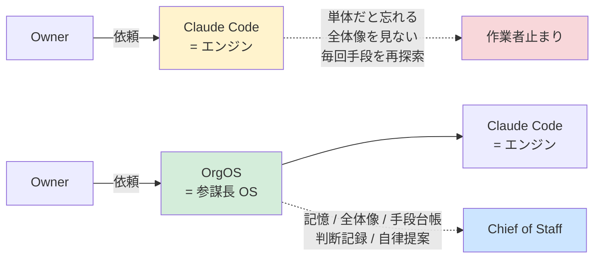

Claude Code はそのままでは「賢い外注作業者」止まりです。OrgOS はその上に **記憶・全体像把握・手段台帳・構造化対話・追跡可能性** を載せて、Owner (あなた) の参謀長として継続稼働させます。

---

## 2. 全体アーキテクチャ — 1 枚絵

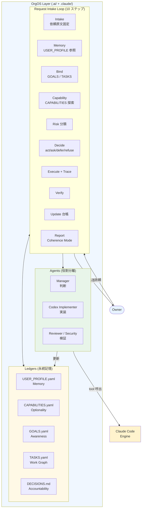

---

## 3. なぜ Claude Code 単体では足りないのか

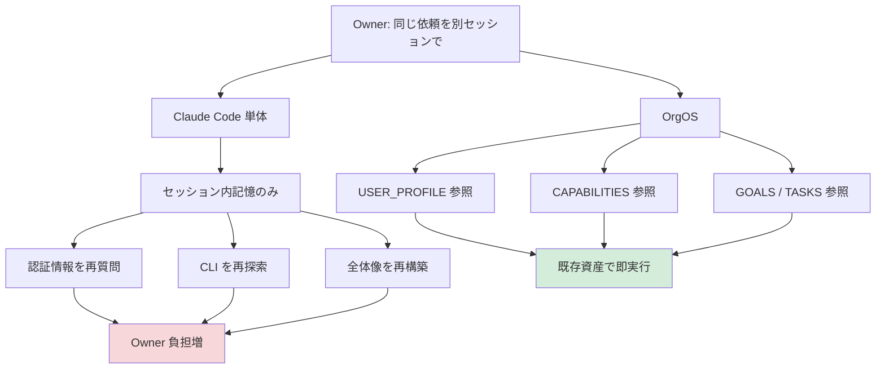

| 症状 (Claude Code 単体) | 原因 | OrgOS の解決 |
|------------------------|------|--------------|
| 同じ質問を毎セッション繰り返される | セッションを越えた構造化記憶がない | `USER_PROFILE.yaml` で fact / preference / secret pointer を永続化 |
| CLI で取れる情報も「GUI で取って」と言われる | 使える手段が台帳化されていない | `CAPABILITIES.yaml` で 58+ ツールの利用可否を台帳化 |
| 単発依頼で進行中プロジェクト文脈が無視される | 全体像と個別依頼を結ぶ仕組みがない | `bind-request.sh` が依頼を進行中タスクへ自動バインド |
| 「次どうする？」と毎回聞かれる | 自律提案の基盤がない | `suggest-next.sh` が Owner preference を考慮した P0/P1/P2 候補を提示 |
| 何を誰がいつ決めたか追えなくなる | 決定の永続記録がない | `DECISIONS.md` に PLAN-UPDATE / ISSUE 番号で永続記録 |

---

## 4. 比較表 — Claude Code 単体 vs OrgOS

| 観点 | Claude Code 単体 | OrgOS |
|------|------------------|-------|
| **記憶** | セッション内のみ | `USER_PROFILE.yaml` で永続化 |
| **手段の把握** | 毎回 `which xxx` で探索 | `CAPABILITIES.yaml` で台帳化 |
| **プロジェクト全体像** | 都度 `Read` で再構築 | Vision → Milestone → Project → Task の 4 階層 Work Graph |
| **依頼の文脈付け** | なし | 進行中タスクへ自動バインド |
| **判断記録** | チャット履歴のみ | `DECISIONS.md` に永続記録 |
| **実装と判断の分離** | 1 エージェントが全部 | Manager + Codex Implementer + Reviewer |
| **次手の提案** | Owner 指示まで停止 | Owner preference を考慮した能動提示 |
| **権限境界** | プロンプト次第 | Autonomy Level (silent/report/ask/owner_only) を機械判定 |
| **委譲プロトコル** | 自由形式 | Handoff Packet スキーマ強制 |
| **品質の自己評価** | なし | Manager Quality Eval (6 指標 × 20 ケース) |
| **セッション横断の継続** | チャット閉じたらリセット | 7 台帳が SessionStart hook で自動再ロード |

---

## 5. OrgOS の核 — Chief of Staff モデル (MAOPA)

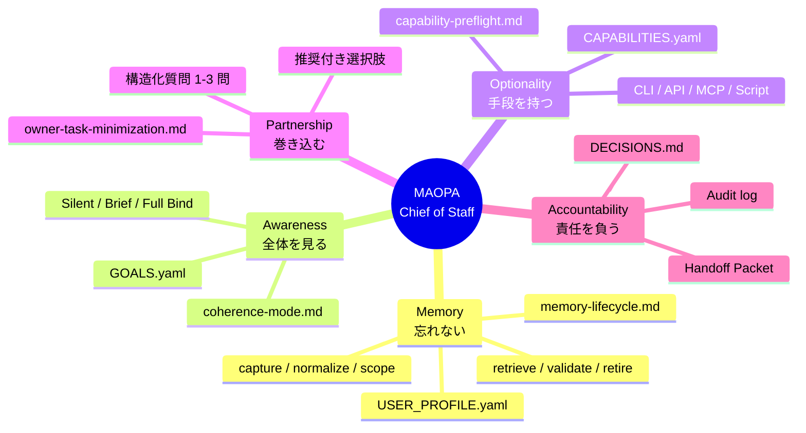

### 各柱の対応表

| 柱 | 意味 | 主要ファイル |
|----|------|--------------|
| **M**emory | Owner の資産・会話・好みを永続保持 | `USER_PROFILE.yaml`, `memory-lifecycle.md` |
| **A**wareness | 単発依頼でも全体像にバインド | `GOALS.yaml`, `coherence-mode.md` |
| **O**ptionality | Owner に依頼する前に手段を総当たり | `CAPABILITIES.yaml`, `capability-preflight.md` |
| **P**artnership | Owner を戦略パートナーとして扱う | `owner-task-minimization.md` |
| **A**ccountability | 全判断・実行に追跡可能な記録 | `DECISIONS.md`, `handoff-protocol.md` |

---

## 6. 依頼処理の流れ — Request Intake Loop

OrgOS Manager は **すべての依頼** を以下 10 ステップで処理します (Iron Law)。

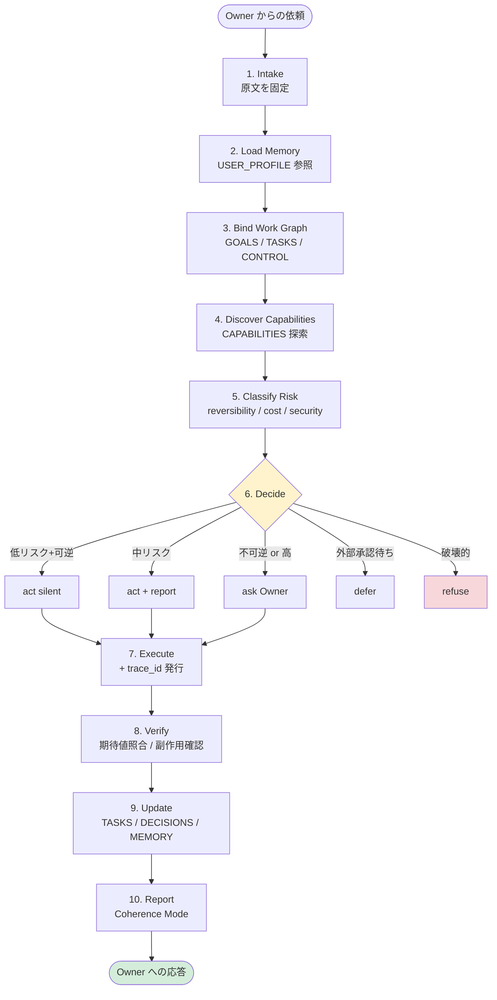

スキップは各 Step の明示条件がある場合のみ許可されます (Iron Law)。

---

## 7. Before / After シーケンス — 認証情報の再利用

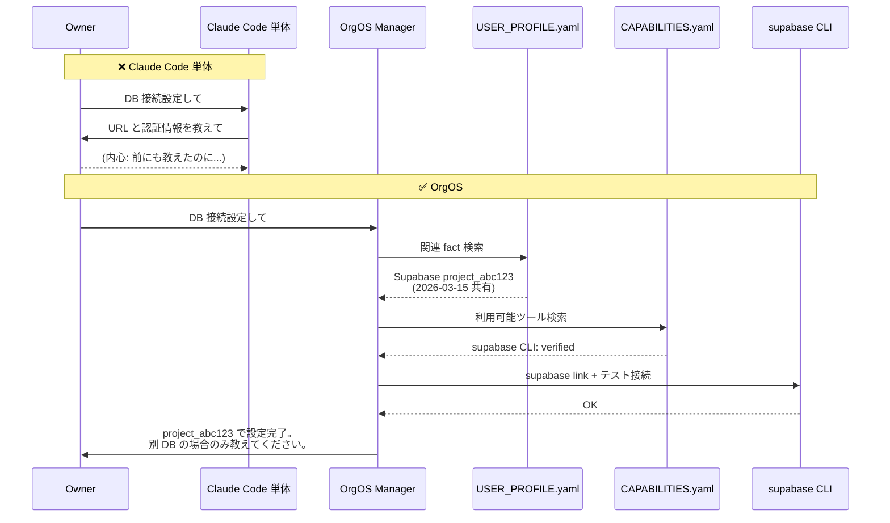

---

## 8. Before / After — 単発依頼の文脈バインド

### Claude Code 単体

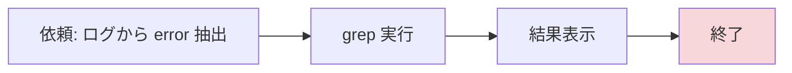

### OrgOS

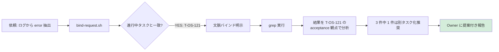

---

## 9. ファイル構成 — どこに何があるか

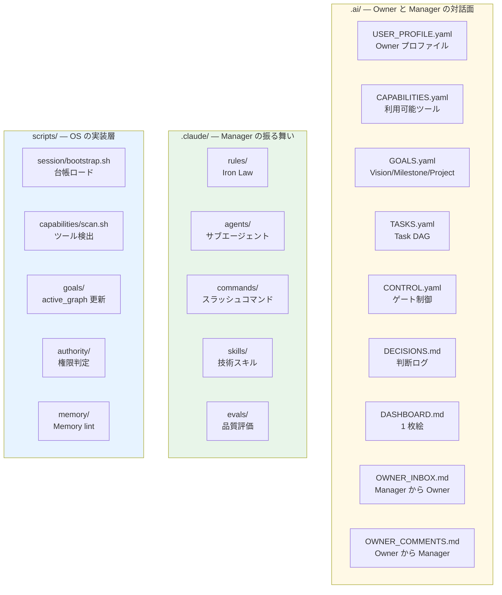

---

## 10. 使うべき場面 / 使わないべき場面

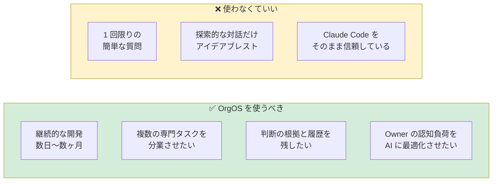

OrgOS は「セットアップとルール遵守のオーバーヘッド」を払う代わりに、「**Owner が Owner にしかできないことに集中できる時間**」を返す投資です。

---

## 11. 始め方

```mermaid
flowchart LR
    A[既存リポジトリに導入] --> A1[claude]
    A1 --> A2[/org-import latest]
    A2 --> A3[/org-start]

    B[新規プロジェクト] --> B1[git clone OrgOS]
    B1 --> B2[remote 切り替え]
    B2 --> B3[claude]
    B3 --> B4[/org-start]

    A3 --> Z[初期化完了]
    B4 --> Z

    style Z fill:#d4edda
```

### 既存リポジトリに導入

```bash
cd <your-project>
claude
/org-import latest
/org-start
```

### 新規プロジェクトとして開始

```bash
git clone https://github.com/Yokotani-Dev/OrgOS.git my-project
cd my-project
git remote remove origin
git remote add origin <your-repo-url>
claude
/org-start
```

詳細は [README.md](../../README.md) を参照。

---

## 12. もっと深く知るには

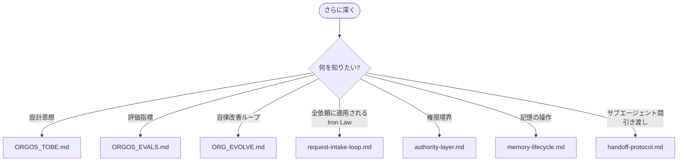

| 知りたいこと | 参照 |
|--------------|------|
| 設計思想の本体 | [ORGOS_TOBE.md](ORGOS_TOBE.md) |
| 評価指標と回帰検出 | [ORGOS_EVALS.md](ORGOS_EVALS.md) |
| 自律改善ループ | [ORG_EVOLVE.md](ORG_EVOLVE.md) |
| 全依頼に適用される Iron Law | [request-intake-loop.md](../../.claude/rules/request-intake-loop.md) |
| 権限境界モデル | [authority-layer.md](../../.claude/rules/authority-layer.md) |
| 記憶の操作プロトコル | [memory-lifecycle.md](../../.claude/rules/memory-lifecycle.md) |
| サブエージェント間の引き渡し | [handoff-protocol.md](../../.claude/rules/handoff-protocol.md) |

---

## まとめ

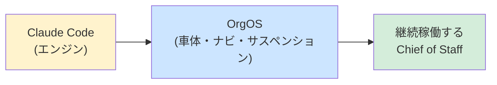

- **Claude Code** = 強力な汎用 AI コーディングエージェント (作業者)
- **OrgOS** = それを Chief of Staff として継続稼働させるための OS レイヤー (参謀長)

両者は競合しません。**OrgOS は Claude Code の上に乗る**ものです。Claude Code がエンジンなら、OrgOS は車体・サスペンション・ナビゲーションシステムにあたります。
