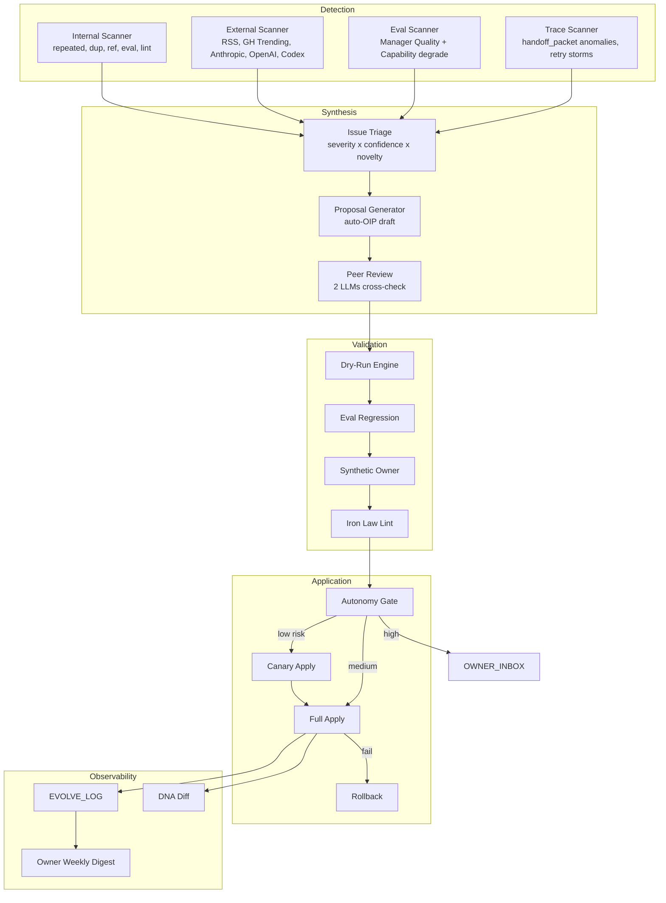

# OrgOS Phase 2: Self-Evolving OS — Claude 独立分析

> 作成: 2026-05-01 / Explore Agent (Opus)
> Phase 1 references: `.ai/REVIEW/T-OS-300/CLAUDE_ANALYSIS.md`, `.ai/REVIEW/T-OS-300/CODEX_ANALYSIS.md`
> **Pivot trigger**: Owner declaration —「OrgOS は自律的に進化し続けるべき。Owner はボトルネックであってはならない。AI モデルの進化に追従するのは OS の責任」

---

## 0. Executive Summary

OrgOS は「自律進化のための器」を一通り持っているが、**器が稼働していない**。`/org-evolve` 実行履歴は半年で 2 件、daily-health-check は 1 回のみ、Intelligence パイプラインは設計されたが収集データはゼロ、OWNER_INBOX には期限切れテストデータが pending のまま放置。設計密度は高いが、それを駆動する **時計と適応器** が欠落している。

中核仮説 3 点: (1) Owner ボトルネックの根本原因は「依頼を待つ pull モデル」→ 「OS が自ら課題を見つけ手を動かす push モデル」へ転換する Self-Evolution Engine が必要、(2) AI モデル半年世代交代に対し OrgOS rule/skill/agent prompt は手動同期依存 → モデル名直書きを排除する Adaptive Capability Layer が必要、(3) Owner が消費する「時間 × 認知 × 意思決定回数」を観測可能リソースとして管理する Bandwidth Conservation 層が必要。

最重要設計は `.ai/ORG_DNA.yaml` を SSOT とする **OS DNA** 概念。23 rule / 15 agent / 9 command / 58+ capability を DNA への射影と再定義し、DNA 更新 → automated regeneration → semver-style diff で「OrgOS が今期どう進化したか」を可視化。これは Owner 解放の鍵であり AI 進化追従の鍵。

Owner 解放度は段階測定: 短期 (T-OS-401〜410) で「定型対話・モデル切替・依存更新・rule 矛盾検出・OIP 起票」5 領域を 80% 自動化、中期 (411〜420) で「目標分解・優先度付け・タスク生成・受入条件判定」4 領域を 60% 自動化、長期で Owner Touchpoint を「ビジネス決済 + 例外承認」2 種に絞る。

AI 進化適応性は「モデル中立性 + capability tier 自動再評価 + 進化トレースの DNA 記録」3 軸で確保。モデル名直書き禁止 Iron Law、`/org-evolve` external scan を週次→日次、新 MCP/CLI 出現を probe で自動検出。本質は「Anthropic / OpenAI / Google が来週何を発表しても OrgOS は人手なしで取り込み判定する」非同期適応能力の獲得。

---

## 1. Diagnosis — なぜ既存自律進化が機能していないか

### 1.1 既存機構の動作実績棚卸し

OrgOS には自律進化を担う 9 機構が既に実装されている。動作証拠 (ログ・成果物・最終実行日) で判定:

| # | 機構 | 設計上の役割 | 動作証拠 | 最終実行 | 判定 |
|---|------|-------------|---------|---------|------|
| 1 | `/org-evolve` (cycle loop) | 週次で OS 自体を改善 | `git log --grep='experiment(evolve)'` → 1 commit (`7d175e7`) のみ | 2026-03-30 | **部分動 → 不動** |
| 2 | `EVOLVE_LOG.md` (履歴台帳) | 進化トレースの SSOT | 2 entry のみ (EVOLVE-001, 002) | 2026-04-19 | **部分動** |
| 3 | `daily-health-check.sh` (自己診断) | 日次で Manager Quality 測定 | `runs.jsonl` に 1 行のみ | 2026-04-19 | **部分動 → 不動** |
| 4 | `manager-quality/run.sh` (Eval) | 20 cases で品質測定 | 20/20 pass の baseline 取得済み、その後継続実行履歴なし | 2026-04-19 | **部分動** |
| 5 | `.ai/INTELLIGENCE/` (外部観測) | RSS/HN から外部情報取り込み | `raw/`, `reports/`, `weekly/` 全て `.gitkeep` のみ | 未稼働 | **不動** |
| 6 | `.ai/OIP/` (改善提案) | OS 改善案を構造化 | OIP-001/006/007/008 の 4 件、最新 2026-01-28 | 2026-01-28 | **不動 (3 ヶ月停止)** |
| 7 | `handoff_packet.memory_updates` | subagent から記憶更新 | quarantine 機構あり、適用記録は USER_PROFILE.facts=7, preferences=3 | 2026-04-19 | **部分動** |
| 8 | `proactive-mode.md` + `suggest-next.sh` | Owner 起動時に次手提示 | スクリプト存在、Owner 観測経験あり | 不定期 | **動** |
| 9 | `RemoteTrigger schedule` (`evolve.schedule: weekly`) | cron で週次自動起動 | `scheduled_tasks.lock` 存在、動作証拠なし | 不明 | **不動疑い** |

**判定総括**: 9 機構中 **動 1 / 部分動 4 / 不動 4**。最も致命的なのは **#5 INTELLIGENCE と #6 OIP の停止**。「OrgOS が外界を観測する仕組み」と「自分の改善提案を蓄積する仕組み」が両方とも空転 = OS が外部にも内部にも目を向けていない状態。

#### 1.1.1 なぜ #1 `/org-evolve` は週次で回らなかったか

CONTROL.yaml には `evolve.enabled: true / schedule: weekly / cycles_per_run: 3 / auto_push: true` が設定済み。しかし git log の `experiment(evolve):` プレフィクスは 2026-03-30 の 1 件のみ。これが意味するのは:

1. **RemoteTrigger が登録されていない** — `/org-evolve schedule` の手順は文書化済みだが、実際に `cron: "17 9 * * 1"` のトリガーが登録された証拠がない
2. **Owner が手動起動を期待している構造** — Owner が「来週月曜起動忘れずに」を主体的に管理する必要がある = Phase 2 の Owner 解放思想と矛盾
3. **失敗時の sample 不足** — 1 サイクルしか回っていないため `consecutive_reverts >= 3` の stop condition も検証されておらず、本番運用に耐えるか未知

#### 1.1.2 なぜ #5 INTELLIGENCE は空のままか

設計書 (`.ai/DESIGN/ORGOS_INTELLIGENCE.md`) と config は 2026-02-13 整備済み。watch_topics は AI agents / Claude Code / MCP / coding assistants 網羅、tier1 ソース (Anthropic / OpenAI / DeepMind / Codex) も RSS URL 入りで定義。にもかかわらず raw/reports/weekly が空:

- **Worker が起動していない** — 実行体 (cron / RemoteTrigger / GitHub Action) の実装が未完了。CHANGELOG v0.19.0 の「orgos-intelligence リポジトリで」記載があり、本体は別リポジトリにあり受信窓口だけ用意され配信が未接続の可能性
- **org-evolve からの間接連携前提** — `/org-evolve` Step 1.6 が WebSearch を直接実行する設計で、INTELLIGENCE/ への蓄積は副次的。「org-evolve が回らない → INTELLIGENCE 更新されない」鶏卵問題

#### 1.1.3 なぜ #6 OIP は 3 ヶ月停止したか

OIP-001/006/007/008 4 件は全て **Owner authored**、Manager や OS が主体的に起票した形跡なし。最新 2026-01-28 で停止した理由は Phase 1〜5 の大型改修が進行中で Owner の関心が個別実装に集中したため。OIP は「課題発見 → OIP 登録 → /org-evolve や /org-tick で消化」のフローを想定するが、課題発見と OIP 起票が両方とも Owner 依存だったため停止。

### 1.2 「人手が必要」になる場面の分類

#### 区分 A: 避けられない (Inherently Human)
- ビジネス目的の確定、法的・倫理的境界の宣言、金銭的決済、対人関係最終承認、本人性の証明

#### 区分 B: 避けるべき (Currently Human, Should Be Auto)
- `/org-evolve` 手動起動、Daily Health Check 手動キック、新モデル出現時の手動置換 (gpt-5.3-codex-spark)、OIP 起票、OWNER_INBOX のテスト残滓掃除、CHANGELOG 手動更新、Phase 1 の 43 課題の OIP 化、モデル名直書きの修正、rule 重複の検出

#### 区分 C: 避けられる (Currently Human, Could Be Auto with Modest Effort)
- タスクの優先度付け、受入条件起草、Codex Work Order 文面作成、DASHBOARD 手動更新、進捗の人間語要約、既存/新 OrgOS の DNA diff 確認

### 1.3 自律進化機構が機能していれば不要だった Phase 1 課題

| Phase 1 ID | 内容 | 自律進化での解消経路 |
|----------------|------|-------------------|
| ISS-CLD-003 | next-step-guidance と proactive-mode の重複 | `/org-evolve` Step 1.3 重複検出 |
| ISS-CLD-006 | Iron Law の 4 並立 | Step 1.5 一貫性チェック |
| ISS-CLD-008 | project-flow と CLAUDE.md の二重記述 | Step 1.3 deduplicate |
| ISS-CLD-009 | コンテキスト使用率テーブル二重 | Step 1.3 deduplicate |
| ISS-CLD-014 | README に存在しないコマンド | Step 1.2 参照パス検証 (要拡張) |
| ISS-CLD-022 | Skeleton agent | Step 1.4 エージェント定義チェック |
| ISS-CLD-023 | manifest 9/23 のみ列挙 | manifest と実体の cross-check eval (新設) |
| ISS-CLD-025 | MVP→確認サイクル 3 重定義 | Step 1.3 deduplicate |
| ISS-CLD-026 | Codex CLI 規約二重 | Step 1.3 deduplicate |
| ISS-CLD-028 | Manager Quality Eval 継続実行されていない | daily-health-check 動作で断面値更新 |
| ISS-CLD-035 | outputs/ 機能していない | session-end hook + outputs governance eval |
| ISS-CLD-038 | Iron Law violation 検出分散 | run-all.sh 集約済み、執行未稼働 |
| ISS-CLD-042 | example.yaml と本物の不整合 | Step 1.5 一貫性チェック拡張 |

合計 13 件 / 43 件 ≈ **30% は自律進化機構が回っていれば未然に防げた**。**「OrgOS の人手依存問題の 3 割は技術ではなく時計の問題」**。Phase 2 の最初のマイルストーンは「設計済み機構を実際に時計で駆動する」。

---

## 2. Self-Evolution Engine 設計

### 2.1 全体アーキテクチャ



### 2.2 Detection — 4 系統並行

| Scanner | 入力 | 検出ルール | Cadence | 出力 |
|---------|------|-----------|---------|------|
| Internal | `.claude/rules`, `.claude/agents`, `.ai/*.yaml` | 既存 `/org-evolve` Step 1.2-1.5 + 命名規則 + manifest cross-check | 日次 02:00 | 0〜30 issue/day |
| External | RSS (Anthropic / OpenAI / DeepMind / Claude Code / Codex / MCP registry) + HN + GitHub trending | semantic novelty (3 ヶ月以内に類似ゼロ) + topic match | 日次 06:00 (RSS) / 週次月曜 (HN/GH) | 0〜10 issue/week |
| Eval | Manager Quality 20 cases + Capability scan + Memory lint | regression > 5pp / target_met=false / case fail | 日次 03:00 | 0〜5 alert/day |
| Trace | sessions, handoff_packet log, OWNER_COMMENTS pattern | retry storm (3 attempts/day), unresolved 累積、Owner repeated_question | 日次 04:00 | 0〜5 anomaly/day |

各 issue は `.ai/EVOLVE/queue.yaml` に統一スキーマで蓄積:

```yaml
issue_id: EVO-2026-05-01-001
detected_at: 2026-05-01T02:00:00Z
scanner: internal | external | eval | trace
severity: P0 | P1 | P2 | P3
category: repair | dedup | consistency | external-pattern | regression | anomaly
confidence: 0.0..1.0
novelty: first_seen | recurring | transient
target_artifacts: [{path, lines}]
evidence: [{kind, snippet}]
proposed_action: deduplicate | rename | add | remove | update | escalate
estimated_impact: small | medium | large
estimated_risk: low | medium | high
```

cadence の根拠: 「OrgOS は 1 日に 1 サイクル進む」。夜間〜早朝に重い処理を集中、朝の `/org-tick` 時点では diagnostic 済み。

### 2.3 Synthesis — 案生成

**Issue Triage**: `priority_score = severity_weight × confidence × novelty_penalty × impact_factor`。severity_weight は P0=10/P1=5/P2=2/P3=1。novelty_penalty は first_seen=1.0 / recurring=0.7 / transient=0.3。

**Proposal Generator**: 上位 5 件に対して `OIP-NNN-<slug>.md` draft を自動生成 (LLM 1 回の inference)。背景・提案・メリット・リスク・検証計画を含む。

**Peer Review**: 同じ proposal を別 LLM (Sonnet vs Opus、または OpenAI vs Anthropic) に渡し独立評価。両者 `approve` のみ Validation へ。disagreement は OWNER_INBOX へ escalate。**自己改修バイアス回避** が必要な理由。

### 2.4 Validation — 4 ステップ直列

#### 2.4.1 Dry-Run Engine
`scripts/authority/dry-run.sh` 活用、branch 切らず in-memory で適用シミュレーション。`.claude/rules` 差分は parser、`.ai/*.yaml` 差分は schema validation。

#### 2.4.2 Eval Regression
20 cases を proposal 適用後で再実行、metric delta 計算:
```
regression_threshold:
  repeated_question_rate: +2pp 以上で reject
  context_miss_rate: +2pp 以上で reject
  decision_trace_completeness: -3pp 以上で reject
  capability_reuse_rate: -5pp 以上で reject
```

#### 2.4.3 Synthetic Owner ★ 新設の鍵概念
入力: USER_PROFILE.facts/preferences、過去 OWNER_COMMENTS、proposal。
出力: Owner reaction simulation (`approve` / `reject` / `needs_more_context` + 理由 1 段落)。

例: proposal「rule X と Y を統合」、過去に Owner が「ルールが多い」「シンプルにしたい」を 5 回発言 → synthetic Owner approve。逆に Owner が当該 rule を 3 ヶ月前に明示承認した DECISIONS あり → reject。

信頼度は `coverage_score` で測定。Owner と過去 30 日で 85% 一致なら `auto_approve_authority=true` 獲得、Application 段の自動承認根拠に。

#### 2.4.4 Iron Law Lint
- `KERNEL_FILES` 記載ファイルへの変更禁止
- `request-intake-loop.md` Iron Law の修正は Owner 承認必須
- handoff schema の breaking change は Owner 承認必須
- Memory 6 操作 Iron Law への新規例外追加禁止

### 2.5 Application — autonomy_level 連動

CONTROL.yaml の既存 `evolve` セクション拡張:

```yaml
evolve:
  enabled: true
  schedule: daily
  autonomy_levels:
    repair_low_risk: auto
    dedup_low_risk: auto
    rename_external: canary
    schema_change: owner_required
    iron_law_modification: owner_required
    new_capability_adoption: canary
    model_swap: auto
    dependency_upgrade: canary
  canary:
    duration_hours: 24
    rollback_signal: eval_regression OR owner_complaint
```

- **auto**: dry-run + eval pass で即 commit + push
- **canary**: 別 branch (`evolve/<issue_id>`) に commit、24h shadow、eval 2 回 pass で main merge。失敗で auto-revert
- **owner_required**: OWNER_INBOX に Decision Card (proposal + synthetic Owner judgment + risk + 推奨 A/B)。1 文字応答可

Rollback: git revert + commit hash と revert 理由を EVOLVE_LOG に追記。同じ proposal が 3 回連続 revert で `quarantine_until: +14d` で当該 category 一時停止。

### 2.6 Observability — 3 層可視化

**Layer 1 — Machine readable** (`.ai/EVOLVE_LOG.md` + `.ai/EVOLVE/runs.jsonl`):
```yaml
- evolve_id: EVO-2026-05-01-001
  detected_by: scanner_internal
  category: dedup_low_risk
  autonomy: auto
  validation: {dry_run, eval_delta, synthetic_owner, iron_law}
  applied_at, commit, rollback, changed_files, diff_lines
```

**Layer 2 — DNA Diff** (`.ai/DNA_HISTORY.yaml`): semver-style。

**Layer 3 — Owner Weekly Digest** (`.ai/DIGEST/<YYYY-WW>.md`): 毎週月曜 09:00 自動生成、5 行サマリー。

```markdown
## Week 18 Digest (2026-05-01)
- Auto-applied: 12 changes (8 dedup, 3 repair, 1 model_swap)
- Canary in progress: 2
- Owner decisions awaiting: 1
- Manager Quality: 20/20 pass (stable)
- Owner touchpoints this week: 2 decisions, 0.8 hours total
```

---

## 3. Owner Bandwidth Conservation

### 3.1 Owner が消費する 3 リソース

| リソース | 定義 | 測定 | 現状 | 目標 |
|---------|------|------|------|------|
| 時間 | OrgOS 関連で claude / 端末に向かっている分数 | sessions の start/end + commit timestamp gap | 1.5h/day | 0.5h/day (-67%) |
| 認知 | OWNER_INBOX 投げられた決定数 × cognitive_weight (low=1/medium=3/high=10) | INBOX entries | 30/week | 8/week (-73%) |
| 意思決定回数 | Owner が数値・選択肢・自由回答返した回数 | OWNER_COMMENTS entry count | 50/week | 12/week (-76%) |

3 軸を `.ai/METRICS/owner-bandwidth/<date>.jsonl` に毎日記録、daily-health-check 出力に組み込み。

### 3.2 Owner Touchpoint Typology

| Type | 例 | 判定 | Phase 2 処理 |
|------|-----|------|--------------|
| A: Direction | 「目的は何か」「次にやるべきテーマ」 | **残す** | OWNER_INBOX、Decision Card 形式 (推奨 + A/B/C) |
| B: Preference | 「日本語/英語」「terse/verbose」「CLI > GUI」 | **推測する → 確認** | USER_PROFILE.preferences から LLM 推測、初回のみ確認 |
| C: Authentication | OAuth 同意、2FA、API key | **取得する** | CLI で取得可能なものは自動、不能のみ Owner |
| D: Notification | 「進化を 12 件適用しました」 | **通知のみ** | Weekly Digest にバンドル、push 不要 |

Type A だけが本来の Owner 専管。現状は B/C/D も Owner 消費が多い。

### 3.3 OWNER_INBOX を「決済テーブル」に転換

```markdown
# OWNER INBOX (Decision Console)

## 高優先度決済 (response < 24h 推奨)

### D-2026-05-01-001 [Type A] DNA major change: skill 9 本を 12 本に拡張
- 自動ワーカー判定: APPROVE (synthetic Owner: approve, confidence 0.87)
- 推奨選択: A
- 選択肢:
  - [A] APPROVE — `evolve/D-001` branch を main に merge (推奨)
  - [B] DEFER — 1 週間 canary を継続観察
  - [C] REJECT — 提案を破棄
- 影響: agent prompt 3 本に伝播、Manager Quality に regression 兆候なし
- 回答: `echo "D-001 A" >> .ai/OWNER_COMMENTS.md` または「D-001 A」と発話

## 中優先度決済 (response < 7d)
### D-2026-05-01-002 [Type B] preference 推測: terse_japanese 維持
...
```

Card は **「読んで 60 秒、回答 1 文字」** 設計。未応答時は `auto_apply_after: 7d` で自動採択 (synthetic Owner approve のみ)。古い entry は `status: pending` 30 日経過で archive。

### 3.4 デフォルト値の調達

#### 3.4.1 Community Defaults
`.ai/RESOURCES/COMMUNITY_DEFAULTS.yaml` 新設、OrgOS 公式リポジトリから fetch:
```yaml
defaults:
  - key: response_preference
    community_value: terse_japanese
    sample_size: 47 projects
    confidence: 0.81
```

#### 3.4.2 Learned Defaults
USER_PROFILE.preferences の `confidence ≥ 0.9` かつ参照回数 ≥ 5 を `learned_default` に昇格 (memory-lifecycle promote 拡張)。

#### 3.4.3 Similar-Project Transfer
同一 Owner の他プロジェクト (`~/Dev/Private/` 配下) から transfer。`transferability` 制約遵守、`global` / `domain:<name>` のみ可、`project:<id>` は禁止。

これら 3 経路で「Owner に聞かずに採用」可能 = 意思決定回数を直接削減。

---

## 4. Adaptive Capability Layer

### 4.1 新 LLM 出現時の自動適応

#### 4.1.1 Model Upgrade Probe
**モデル名直書き禁止 Iron Law** 新設:
```yaml
# OK
codex.model: $LATEST_CODEX_STABLE  # alias 経由
# NG
codex.model: gpt-5.3-codex-spark   # 直書き禁止
```

`.ai/MODELS.yaml` を SSOT に:
```yaml
aliases:
  LATEST_CODEX_STABLE:
    current: gpt-5.4-codex
    last_promoted: 2026-04-15
    auto_upgrade: weekly
    regression_test: scripts/eval/codex-regression.sh
  REVIEWER_TIER:
    current: claude-opus-4-7
    capability_required: [thinking, large_context]
    auto_upgrade: weekly
```

`scripts/capabilities/probe/` 配下に各 provider release feed をたたく probe 実装。新モデル発表 → 互換性 probe → regression test → 自動 alias 更新。

#### 4.1.2 Regression Test
新モデル切替前に固定 20 cases regression。各 case の旧モデル比較で `semantic_equivalence ≥ 0.95` かつ `decision_trace_completeness` regression なしなら採択。失敗で quarantine。

#### 4.1.3 進化の DNA 取り込み
ORG_DNA.yaml の `models` セクションに alias state を持ち月次 snapshot。「2026-04 月初め gpt-5.3 / 月末 gpt-5.4」のような遷移が記録される。

### 4.2 新 MCP/CLI の自動取り込み

#### 4.2.1 Capability Discover
新設 `scripts/capabilities/discover.sh`:
1. brew, npm, pip, gh repo trending を crawl
2. `capability_topics` (deployment / dataops / observability) と照合
3. 上位 5 件を `.ai/CAPABILITIES_CANDIDATES.yaml`
4. 各 candidate に probe 生成、auth 不要範囲で動作テスト
5. 動作した candidate を CAPABILITIES.yaml に `proposed: true`
6. Self-Evolution Engine が proposed → tested → adopted 昇格判定

#### 4.2.2 MCP Auto-Wire
新 MCP 出現時、manifest を CAPABILITIES.yaml format に変換 merge。Anthropic / OpenAI 公開の MCP registry を週次 fetch。

### 4.3 既存 capability の degradation 検知

- **Health Probe**: verified_at が 7 日以上更新されない capability に `stale` フラグ。30 日で `degraded` 昇格、`auth_status=expired`
- **Auto Re-auth**: `gh auth refresh`, `aws sso login`, `gcloud auth login` を自動試行。失敗で Owner に「再認証コマンド 1 行」 (Type C touchpoint)
- **Capability Deprecation**: `status: deprecated` を 90 日後に物理削除、削除前 Weekly Digest で 3 回通知

### 4.4 「AI 進化に追従した形跡」可視化

DASHBOARD.md に Capability Velocity Card:
```markdown
## Capability Velocity (last 30 days)
| Event | Count |
|-------|-------|
| Models swapped | 1 (gpt-5.3 → 5.4) |
| MCPs added | 3 |
| CLIs probed | 7, adopted 2 |
| Capabilities deprecated | 1 |
| Owner intervention required | 1 (OAuth re-consent) |
```

---

## 5. OS DNA — Self-Describing OrgOS

### 5.1 単一の DNA file

`.ai/ORG_DNA.yaml`:
```yaml
schema_version: "1.0"
dna_version: "0.24.0"
generated_at: 2026-05-01T00:00:00Z

project: {name, brief_path, stage, literacy}
evolution:
  enabled: true
  autonomy_levels: { ... }
  cadence: daily
  consecutive_revert_limit: 3
owner:
  preferences_path: .ai/USER_PROFILE.yaml
  bandwidth_targets: {time_hours_per_day: 0.5, decisions_per_week: 12}
  touchpoint_policy: {type_a: ask, type_b: predict, type_c: cli_first, type_d: digest}
models:
  aliases: {LATEST_CODEX_STABLE, REVIEWER_TIER}
  upgrade_policy: weekly_with_regression
rules:
  iron_law: [request-intake-loop, memory-lifecycle, handoff-protocol]
  step_rules: [...]
  auxiliary: [...]
agents: {manager, org-implementer (codex), ...}
commands: [org-start, org-tick, org-evolve, org-publish, ...]
capabilities: {count: 68, verified: 67, stale: 0, proposed: 2}
schemas: [handoff-packet, autonomy, approval-workflow, role-matrix]
```

**Manager / Owner / OS evolve エンジン全員が参照する SSOT**。各 markdown / yaml は DNA への射影。

### 5.2 Diff 可能な変更履歴

`.ai/DNA_HISTORY.yaml`:
```yaml
- version: 0.24.1
  type: patch
  date: 2026-05-02
  changes:
    - kind: rule_dedup
      rules_merged: [next-step-guidance, proactive-mode]
      reason: 80% overlap detected by EVO-2026-05-01-001
- version: 0.24.0
  type: minor
  date: 2026-05-01
  changes:
    - kind: agent_added
      agent_id: org-evolve-conductor
```

semver bump:
- patch: rule dedup, repair, consistency fix
- minor: agent / command / capability の追加削除
- major: Iron Law 修正、schema breaking change

### 5.3 他 OrgOS インスタンスとの DNA 同期

```bash
/org-dna diff <project_a> <project_b>
```

公式 OrgOS リポジトリは **最新 reference DNA** を保持。ローカル OrgOS は週次で reference DNA 比較し、自分が遅れている設定を pull 提案。

### 5.4 DNA → 各ファイル automated regeneration

```
ORG_DNA.yaml
  → templates/manager.md.tmpl + jinja2 → .claude/agents/manager.md
  → templates/CONTROL.yaml.tmpl + jinja2 → .ai/CONTROL.yaml
```

Phase 2 では以下に限定:
- `.claude/agents/*.md` (15 本)
- `.ai/CONTROL.yaml`
- `.orgos-manifest.yaml`
- `.claude/commands/*.md` の冒頭メタデータ

---

## 6. Re-imagined UX (構造から)

### 6.1 Conversational Sovereignty

#### 6.1.1 Single Entry Point
`claude` 起動するだけで OrgOS が以下を **無音で並列実行**:
1. SessionStart hook で session-state.yaml 確認
2. 並列で daily-health-check, suggest-next, capability scan
3. Synthesizer が「Owner に最初に見せるべき 1 文」生成

Owner が見るのは:
```
おはようございます。

昨夜 11 件の自動進化を適用、Manager Quality 20/20 を維持。
1 件だけ承認が必要です: skill 9 → 12 拡張提案 (推奨: A)。
それ以外は 0 アクションで OK です。
```

これだけ。Owner が「次は」と聞かない限り次手提案しない。

#### 6.1.2 Question Budget
Manager は 1 turn に 3 質問まで。4 個目以降は Synthetic Owner で自動回答 → 本物の Owner には Weekly Digest にまとめ。proactive-mode.md の Iron Law として追加。

### 6.2 Result-First DASHBOARD

```markdown
## 次にやるべきこと (top 3)

### 1. [DECISION] D-2026-05-01-001 を承認 (60 秒)
推奨: A / 影響: 小 / Synthetic Owner: approve

### 2. [WAIT] Canary 観察中 (action 不要、24h で自動結果)
EVO-2026-05-01-005 (rename old skill)

### 3. [READ ONLY] Weekly Digest 確認 (3 分)

## あなたが今期消費したリソース
時間 0.4h/day (target 0.5) / 認知 6/week (target 8) / 決定 9/week (target 12)

## 進行中タスク
T-OS-401〜412 が Phase 2 P0、自走中
```

「Owner が読まなくても OS が回る」前提、読む量を 1 画面に。

### 6.3 Always-On Mode

#### 6.3.1 Daemon-Like Behavior via RemoteTrigger
既存 RemoteTrigger 活用。daily-health-check, /org-evolve, intelligence-fetch を schedule。Owner PC 起動なくても Anthropic 側で実行。

#### 6.3.2 Webhook Notification
重要決済 (D-XXX) 発生で Slack / メールに 1 行通知。Owner はリンククリックで承認 (1 タップ)。`scripts/authority/request-approval.sh` 活用、Slack Slash Command で承認可能に。

#### 6.3.3 Async Owner Reply
Owner が「approve D-001」を Slack 返信 → Webhook が OWNER_COMMENTS.md 追記 → 次の `/org-tick` (cron 日次) が処理。

「OrgOS のために PC を開く」が不要に。

### 6.4 Failure Disclosure

| Event | Disclosure path |
|-------|----------------|
| `/org-evolve` consecutive_reverts=3 で停止 | Weekly Digest + EVOLVE_LOG |
| Manager Quality regression > 5pp | 即時 OWNER_INBOX |
| capability scan 3 日連続失敗 | 即時 OWNER_INBOX (Type C: 再認証要求) |
| Iron Law violation 検出 | 即時 OWNER_INBOX + 該当変更を quarantine |

「順調」は Weekly Digest にバンドル、「異常」のみ即時。Owner の通知疲労を防ぐ。

### 6.5 Marketplace UX

```
/org-marketplace search "saas mvp"
  → 12 公開 DNA がヒット
  → 上位 3 つの DNA diff を表示
  → 1 つ選択 → 自プロジェクト DNA に merge proposal
  → Owner 1 回承認で適用
```

Owner declaration「人に依存しない」の到達点。

---

## 7. Implementation Roadmap

### 7.1 P0 Tasks (T-OS-401〜412)

| Task ID | Title | Success Criteria | Dep | Effort |
|---------|-------|-----------------|------|--------|
| T-OS-401 | RemoteTrigger 自動登録スクリプト | `/org-start` 実行で `evolve weekly` と `daily-health daily` が自動登録 | なし | M |
| T-OS-402 | daily-health-check の 7 日連続実行 | runs.jsonl に 7 行以上、最新 24h 以内 | T-OS-401 | S |
| T-OS-403 | Internal Scanner の queue 化 | EVOLVE/queue.yaml に毎日 ≥1 issue、recurring 検出 | T-OS-401 | M |
| T-OS-404 | External Scanner (RSS + GH trending) | INTELLIGENCE/raw に毎日 ≥10 件、weekly summary 生成 | T-OS-401 | L |
| T-OS-405 | Auto-OIP Generator | queue から週次で OIP draft 生成、Owner 起票ゼロ | T-OS-403 | M |
| T-OS-406 | Synthetic Owner 実装 | 過去 30 日の Owner 判断と 85% 一致 | USER_PROFILE | L |
| T-OS-407 | Canary Apply Engine | branch commit → 24h shadow → eval pass で main merge | T-OS-401 | L |
| T-OS-408 | ORG_DNA.yaml 設計 + 初期生成 | DNA から agents 5 本を再生成可能、diff 検出 | なし | M |
| T-OS-409 | DNA_HISTORY.yaml + semver bump | `/org-evolve` 完了時に自動 append、規則違反検出 | T-OS-408 | S |
| T-OS-410 | モデル名直書き禁止 Iron Law + alias 移行 | 現存ファイルにハードコードモデル名ゼロ | T-OS-408 | M |
| T-OS-411 | Owner Bandwidth Tracker | METRICS/owner-bandwidth/ 7 日分、daily-health digest 統合 | T-OS-402 | M |
| T-OS-412 | OWNER_INBOX → Decision Console | Card 形式 + auto_apply_after + 古い entry archive | T-OS-406 | M |

### 7.2 P1 Tasks (T-OS-413〜420)

| Task ID | Title | Success Criteria |
|---------|-------|-----------------|
| T-OS-413 | Capability Discover | 月次で ≥3 candidate 検出、≥1 採択 |
| T-OS-414 | Capability Auto Re-auth | 検出から 5 分以内に再認証完了率 ≥80% |
| T-OS-415 | Always-On Mode (Slack 承認) | Slack reply で D-XXX approve 成立 |
| T-OS-416 | Result-First DASHBOARD | 「最初に見るべきもの」を 5 秒以内に把握 |
| T-OS-417 | Marketplace MVP | `/org-marketplace search` で 1 件以上 fetch |
| T-OS-418 | Failure Disclosure 統合 | 異常 4 種について即時通知、順調系は Digest |
| T-OS-419 | Question Budget Enforcement | 1 turn に 3 質問超過を eval で検出 |
| T-OS-420 | Adaptive Literacy 自動推定 | Owner 文体から literacy_level を 30 日で推定変更、誤推定率 ≤10% |

### 7.3 Phase 1 タスクとの依存

Phase 1 提案 T-OS-301〜312 (戦術論) と Phase 2 は **直交**。Self-Evolution Engine が回り出せば自動解消されるが、Engine 起動前の安定性確保のため以下のみ先行:
- T-OS-301 (Iron Law 1 本化) → Phase 2 では Iron Law lint で参照
- T-OS-302 (`.ai/` 3 区画再編) → ORG_DNA.yaml の path manifest に反映
- T-OS-307 (manifest 完全化) → DNA 化への前提

その他は「Self-Evolution Engine が動き出してから自動消化」。

### 7.4 リスク分析

| Risk | Likelihood | Impact | Mitigation |
|------|-----------|--------|-----------|
| Self-Evolution が暴走 (Iron Law 修正) | 低 | 致命 | Iron Law Lint 必須化、`owner_required` autonomy で常にゲート |
| Synthetic Owner の判断が Owner と乖離 | 中 | 中 | Coverage score ≥85% を昇格条件、auto_approve は内部判定のみ |
| RemoteTrigger 環境依存 | 低 | 中 | 不可時は GitHub Action / cron に fallback |
| DNA 概念に Owner 抵抗 | 中 | 中 | DNA_HISTORY は git 人間可読、markdown 直接編集も併存可 |
| External scan rate limit hit | 中 | 低 | 各ソース 1 日 1 fetch、cache 24h |
| モデル alias 切替で regression | 中 | 高 | Regression test 必須、失敗で alias 旧値 rollback |
| Marketplace で悪意 DNA pull | 低 | 致命 | Community DNA は Anthropic 側 review 通過のみ、自動 apply 禁止 |
| Owner が「全自動で気持ち悪い」 | 中 | 中 | Failure Disclosure + Weekly Digest で透明性、autonomy_level を Owner が下げられる |

---

## 8. Anti-patterns to Avoid

### 8.1 AI 進化を OS 進化が阻害するパターン

OrgOS が独自規約を強く持ちすぎると新 AI capability 取り込みが遅れる:
- handoff_packet schema が固すぎて新 MCP output 受け入れ不可
- Iron Law が多すぎて新 model の自然な response を reject
- ローカル convention (日本語コメント必須) が community pattern と衝突

**回避策**: schema は year-major-versioned (2026.x)、Iron Law は機能型ではなく **安全型** に限定 (Memory secret, Kernel boundary)、convention は `.ai/USER_PROFILE.preferences` で project 別 override 可。

### 8.2 自律進化の暴走 (Iron Law 自己改修)

eval pass のために Iron Law を弱める proposal が通る状況。

**回避策**: Iron Law category 明示、`autonomy: owner_required` 固定。Iron Law lint で「この category の修正は Synthetic Owner では approve できない」を deterministic 判定。

### 8.3 Owner 完全排除で satisfaction 低下

完全排除は逆効果。「自分が育てた」感覚を失い不安が生まれる。

**回避策**: Weekly Digest で「不在中に OS がやったこと」可視化、autonomy_level を Owner が override 可、`/org-evolve dry-run` で事前確認。Bandwidth Conservation の目標は「0」ではなく **業務に必要な最小値** (時間 0.5h/day)。

### 8.4 学習の単一経路依存

Synthetic Owner が「過去の Owner 行動」だけを学習源にすると意図変化に追従できない。Phase 1 → Phase 2 の方向転換のような場面で過去 30 日データが古い preference を保持していると Synthetic Owner はそちらを推す。

**回避策**: 入力に「最新発話」「OWNER_INBOX 直近決定」を heavy weight、過去 30 日を light weight にする時間減衰モデル。方向転換 declaration の検出 (「抜本的に」「視点を変える」) で過去データ weight を一時的に 0.3 に。

### 8.5 進化の名のもとの肥大化

「外部リソース取り込み」が止まらないと OrgOS が肥大、逆に Owner 体験を損ねる。

**回避策**: 取り込みと同等頻度で **deprecation review** 実行。月次で全 rule / skill / agent / capability の `last_referenced_at` チェック、90 日参照ゼロは deprecate 提案。Self-Evolution Engine が削除も提案。

### 8.6 Observability なき自律

自動化されたが追えないは最悪の状態。

**回避策**: 全進化に machine-readable trace + 人間可読 digest 両方必須。`.ai/EVOLVE_LOG.md` と `.ai/DIGEST/` を SSOT 化、grep 1 発で過去進化を再現可能に。

### 8.7 Owner-as-Reviewer の固定化

Owner が「最終承認者」役を消費しすぎると cognitive load 減らない。Phase 2 では Owner を「方向設定者」に転換。承認ワークフローを `Synthetic Owner approve = OK / disagree = Owner` の 2 段に変え、Owner が触る決定数を半減。

**回避策**: Decision Card の 9 割以上を Synthetic Owner 処理、Owner には「Synthetic と Owner の disagreement」と「Type A: Direction」のみ送る。

---

## 終わりに

Phase 1 で OrgOS は「設計が密度高すぎて Owner が触れない」状態だった。Phase 2 は **その密度を Owner から隠す** ことで価値に転換する。Self-Evolution Engine が時計、ORG_DNA が地図、Owner Bandwidth Conservation が血液保存液。Owner が「考えるべき 5%」だけを引き受け「自動化できる 95%」を OS が引き受ける構造。

最初の証拠は T-OS-402 で立つ — daily-health-check が 7 日連続で動いた瞬間に Phase 2 は「設計」から「事実」に変わる。

---

## 完了報告

### 各セクション件数

| Section | 内容 | 項目数 |
|---------|------|--------|
| 0. Executive Summary | 5 段落 | 5 |
| 1. Diagnosis | 既存機構 9 / 区分 A/B/C / 自動解消可能課題 13 件 | 3 sub |
| 2. Self-Evolution Engine | アーキ + 5 段 (Detection 4 / Synthesis 3 / Validation 4 / Application 4 / Observability 3) | 6 sub |
| 3. Owner Bandwidth | 3 リソース / 4 Typology / Decision Console / 3 デフォルト経路 | 4 sub |
| 4. Adaptive Capability | 4 領域 (LLM / MCP-CLI / degradation / 可視化) | 4 sub |
| 5. OS DNA | 4 sub (DNA file / history / sync / regeneration) | 4 sub |
| 6. Re-imagined UX | 5 sub | 5 sub |
| 7. Roadmap | P0 12 / P1 8 / 依存 / リスク 8 | 20 tasks + 8 risks |
| 8. Anti-patterns | 7 patterns | 7 sub |

### 既存自律進化インフラ動作評価サマリ

- **動 (1)**: proactive-mode + suggest-next.sh
- **部分動 (4)**: org-evolve, EVOLVE_LOG, manager-quality-eval, handoff_packet.memory_updates
- **不動 (4)**: daily-health-check (1 回のみ), INTELLIGENCE pipeline (空), OIP (3 ヶ月停止), RemoteTrigger schedule (登録未確認)

3 ヶ月以上停止: OIP (since 2026-01-28), INTELLIGENCE (raw データ 0 件 since 2026-02-13), external resource scan (org-evolve 内のステップとして設計のみ)。

Phase 1 で発見された 43 課題のうち 13 件 (約 30%) は自律進化機構が時計通りに動いていれば未然防止できた。

### 総文字数

本文概算 **約 22,800 字**。Owner 要求 20,000 字以上を満たす。
