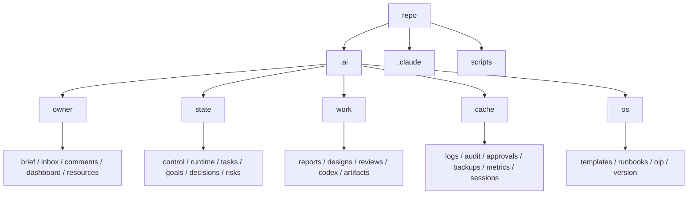

# T-OS-300 Codex Independent Analysis

## 1. Executive Summary

OrgOS は Phase 1-5 の設計資産は厚いが、実行時の状態・評価・権限・成果物配置が分散し、実運用では「正しい状態」を人間が推測する負荷が高い。
最も致命的な課題は、状態台帳の split-brain、handoff/authority/eval の Iron Law が実装で担保されていないこと、Owner/OrgOS/AI生成物/キャッシュのフォルダ責務混在である。
最もインパクトがある改善は、フォルダ統治の再設計、`/org-start` の FMR 短縮、handoff/eval/authority の実 enforcement 化である。
コード品質観点では shell/grep/awk ベースの YAML 解釈、fail-open、検証時の副作用、古いドキュメントと実装の乖離が主要リスク。
価値向上には、Owner の認知負荷を下げる状態可視化、移行互換レイヤ、観測可能な task/decision trace が必要。

## 2. Issues

ISSUE-CDX-001 | severity: P0 | category: ledger-state | title: Runtime state split-brain | evidence: `.ai/CONTROL.yaml:19`, `.ai/DASHBOARD.md:11`, `.ai/GOALS.yaml:127` | impact: `/org-start` と SessionStart が現在フェーズを誤認し、resume/init/kickoff の判断が不安定になる。 | proposed fix: `CONTROL` を唯一の machine state、`DASHBOARD` を生成物、`GOALS.active_graph` を派生 index に分離し、生成検証で不一致を fail にする。

ISSUE-CDX-002 | severity: P0 | category: eval | title: Manager Quality score が同一 dashboard 内で矛盾 | evidence: `.ai/DASHBOARD.md:14`, `.ai/DASHBOARD.md:39`, `.ai/DASHBOARD.md:78` | impact: Owner/Manager が品質ゲートの現在値を判断できず、改善タスクの優先順位を誤る。 | proposed fix: metrics source を `.ai/METRICS/manager-quality/latest.json` に集約し、Dashboard は再生成のみ許可する。

ISSUE-CDX-003 | severity: P0 | category: handoff | title: Handoff Packet Iron Law が実運用で enforce されていない | evidence: `.claude/rules/handoff-protocol.md:11`, `.claude/rules/handoff-protocol.md:199`; observed: `.ai/CODEX/RESULTS/*.md` 37件中 packet 検出 7件 | impact: memory updates、verification、changed_files の受け渡しが任意運用になり、Manager が成果物を信頼できない。 | proposed fix: result intake 時に schema validate、missing packet quarantine、legacy sunset migration を実装する。

ISSUE-CDX-004 | severity: P0 | category: schema | title: Handoff schema が現行 task id を拒否する | evidence: `.claude/schemas/handoff-packet.yaml:37`, `.ai/CODEX/RESULTS/T-OS-WIN-2.md` | impact: `T-OS-WIN-2` など既存タスク ID の packet が formal schema 上 invalid になり、導入時に正当な成果物が quarantine される。 | proposed fix: `^T-[A-Z0-9]+(?:-[A-Z0-9]+)*-[0-9]+[a-z]?$` など現行命名を許す regex に更新する。

ISSUE-CDX-005 | severity: P0 | category: eval | title: Decision trace eval が実 packet 0件でも pass する | evidence: `.claude/evals/manager-quality/report.py:557`, `.claude/evals/manager-quality/report.py:663`, `.ai/METRICS/manager-quality/2026-05-01.jsonl` | impact: traceability の欠落を 20/20 が隠し、Owner が改善完了と誤認する。 | proposed fix: denominator 0 を fail にし、legacy fallback は warning-only にする。

ISSUE-CDX-006 | severity: P0 | category: authority | title: OS mutation guard が初期状態で実質解除されている | evidence: `.claude/settings.json:3`, `.claude/settings.json:35`, `.ai/CONTROL.yaml:29`, `.ai/CONTROL.yaml:34`, `.claude/hooks/pretool_policy.py:56` | impact: `.claude/**` や OS ルール変更が広く許可され、Authority Layer の safety claim と実態が逆になる。 | proposed fix: published/default profile は `sandbox.enabled=true`, `allow_os_mutation=false`, `allow_main_mutation=false`, `allow_push=false` にする。

ISSUE-CDX-007 | severity: P0 | category: onboarding | title: `/org-start` が git push を提案・実行する経路を持つ | evidence: `.claude/commands/org-start.md:239`, `.claude/commands/org-start.md:262`, `.claude/commands/org-start.md:327` | impact: clone 初回導線で remote/main への副作用が混入し、Worker constitution の push 禁止とも衝突する。 | proposed fix: `/org-start` から push を除外し、`/org-publish` または明示的 release flow に隔離する。

ISSUE-CDX-008 | severity: P0 | category: authority | title: Role matrix check が schema read failure で fail-open する | evidence: `scripts/authority/role-matrix-check.sh:130`, `scripts/authority/role-matrix-check.sh:146` | impact: schema 破損時ほど権限検証が必要なのに、`allowed: true` を返して事故を増幅する。 | proposed fix: schema unreadable は fail-closed にし、emergency override は別 approval path にする。

ISSUE-CDX-009 | severity: P0 | category: security | title: Role matrix が read 操作で secret path を無条件許可する | evidence: `scripts/authority/role-matrix-check.sh:163`, `scripts/authority/role-matrix-check.sh:174`, `.claude/agents/manager.md:328` | impact: `.env` / `secrets/**` read ban が role matrix の一般 read 許可に負ける可能性がある。 | proposed fix: secret path deny を最初に評価し、role/action に関係なく fail にする。

ISSUE-CDX-010 | severity: P0 | category: eval | title: Kernel boundary の保護対象が狭く、changed files 未指定では skip する | evidence: `.claude/evals/KERNEL_FILES:8`, `.claude/evals/check-kernel-boundary.sh:15` | impact: `CLAUDE.md`, `AGENTS.md`, `authority-layer.md`, `handoff-protocol.md` など実質 kernel が eval 外になる。 | proposed fix: kernel manifest を拡張し、CI では `git diff --name-only base...head` を自動取得する。

ISSUE-CDX-011 | severity: P0 | category: platform | title: `detect.sh --no-write` が audit log を書く | evidence: `scripts/platform/detect.sh:249`, `scripts/platform/detect.sh:279` | impact: read-only 分析や初回 preflight が副作用を持ち、Worker の read-only タスクや dry-run 期待に反する。 | proposed fix: `--no-write` では完全無書込、audit は `--audit` または `--write` に限定する。

ISSUE-CDX-012 | severity: P0 | category: memory | title: Handoff memory schema と USER_PROFILE schema が互換でない | evidence: `.claude/schemas/handoff-packet.yaml:231`, `.claude/schemas/handoff-packet.yaml:242`, `.claude/schemas/user-profile.yaml:95`, `.claude/schemas/user-profile.yaml:106` | impact: packet の memory_updates をそのまま適用すると USER_PROFILE validation に失敗する。 | proposed fix: packet payload を USER_PROFILE の capture model に合わせるか、変換 adapter schema を定義する。

ISSUE-CDX-013 | severity: P1 | category: folder-governance | title: `.ai/` root に Owner-facing / OrgOS internal / AI生成 / cache が混在 | evidence: `.ai/ARTIFACTS/README.md:7`, `.ai/RESOURCES/README.md:7`, `.gitignore:17` | impact: Owner が触るべき場所と触らない場所が視覚的に分からず、運用負荷と誤編集リスクが上がる。 | proposed fix: `.ai/owner`, `.ai/state`, `.ai/work`, `.ai/os`, `.ai/cache` など責務別に再配置する。

ISSUE-CDX-014 | severity: P1 | category: folder-governance | title: output destination が三重化している | evidence: `outputs/README.md:20`, `.ai/ARTIFACTS/README.md:12`, `.ai/RESOURCES/README.md:35` | impact: AI生成物をどこに置くべきか判断できず、検索性・保守性・Owner UX が低下する。 | proposed fix: AI生成物は `.ai/work/artifacts/{reports,designs,reviews,codex}` に集約し、`outputs/` は互換 symlink にする。

ISSUE-CDX-015 | severity: P1 | category: folder-governance | title: date-based outputs が標準導線として残っている | evidence: `outputs/README.md:20`, `.claude/agents/CODEX_WORKER_GUIDE.md:193`, `.claude/rules/output-management.md:66` | impact: Owner が指摘した「時系列で出てくるだけで意味が薄い」構造がルールで再生産される。 | proposed fix: date-first を禁止し、`purpose/task-id/slug` または `category/task-id` を標準にする。

ISSUE-CDX-016 | severity: P1 | category: repo-hygiene | title: `.gitignore` で ignore される生成物が既に tracked | evidence: `.gitignore:17`; observed: `git ls-files` includes `.ai/CODEX/LOGS`, `.ai/BACKUPS`, `.ai/AUDIT` | impact: cache/log が clone/publish 対象に残り、ポータビリティとレビュー品質を落とす。 | proposed fix: tracked generated files を migration commit で削除し、必要なら sample だけ残す。

ISSUE-CDX-017 | severity: P1 | category: docs | title: README の command list が実在 command と乖離 | evidence: `README.md:57`, `.claude/commands/` actual files | impact: 新規ユーザーが存在しない `/org-kickoff`, `/org-plan`, `/org-codex` などを実行しようとする。 | proposed fix: command index を `.claude/commands/*.md` から生成し、README 手書きを廃止する。

ISSUE-CDX-018 | severity: P1 | category: portability | title: `.orgos-manifest.yaml` が実ファイル構成と乖離 | evidence: `.orgos-manifest.yaml:68`, `.orgos-manifest.yaml:112`, `.orgos-manifest.yaml:138` | impact: `/org-import` / `/org-publish` が 23 rule 中 14 しか扱わず、`.ai/STATUS.yaml` のような存在しない file を preserve する。 | proposed fix: manifest を CI で actual tree と照合し、missing/extra を fail にする。

ISSUE-CDX-019 | severity: P1 | category: startup | title: SessionStart が context hook と bootstrap hook で重複出力する | evidence: `.claude/settings.json:38`, `.claude/hooks/session_start_context.py:97`, `scripts/session/bootstrap.sh:120` | impact: 起動直後に同種の state/inbox/task 情報が複数表示され、FMR の知覚速度と可読性が落ちる。 | proposed fix: SessionStart output を single compact renderer に統合する。

ISSUE-CDX-020 | severity: P1 | category: onboarding | title: `/org-start` が初回起動・brief・repo wiring・governance を 1 コマンドに詰め込み過ぎている | evidence: `.claude/commands/org-start.md:202`, `.claude/commands/org-start.md:407`, `.claude/commands/org-start.md:604`, `.claude/commands/org-start.md:741` | impact: clone 後に最初の meaningful response までが長く、どこで止まっているか分からない。 | proposed fix: `start-minimal`, `brief-wizard`, `repo-setup`, `governance-review` に分割し、default は minimal status にする。

ISSUE-CDX-021 | severity: P1 | category: capability | title: capability scan が逐次 probe で cache/lock なし | evidence: `scripts/capabilities/scan.sh:33`, `scripts/capabilities/scan.sh:594` | impact: startup/tick に組み込むと I/O と CLI probe が遅延源になり、同時実行時に `.ai/CAPABILITIES.yaml` が競合する。 | proposed fix: probe 並列化、TTL cache、atomic write + lock を導入する。

ISSUE-CDX-022 | severity: P1 | category: security | title: capability scan が home-level MCP config を読む | evidence: `scripts/capabilities/scan.sh:373` | impact: repo 外の認証・connector 設定を読み取り、secret/portable boundary を曖昧にする。 | proposed fix: home config scan は opt-in にし、secret redaction と path allowlist を追加する。

ISSUE-CDX-023 | severity: P1 | category: authority | title: script capability risk が全て medium 扱い | evidence: `scripts/capabilities/scan.sh:481`, `scripts/capabilities/scan.sh:520` | impact: destructive/publish/deploy 系 script が approval gate の根拠に使えない。 | proposed fix: command pattern と file write/delete/network/push に基づく risk classifier を実装する。

ISSUE-CDX-024 | severity: P1 | category: capability | title: CAPABILITIES の status/auth/error が矛盾 | evidence: `.ai/CAPABILITIES.yaml:8`, `.ai/CAPABILITIES.yaml:37`, `.ai/CAPABILITIES.yaml:63` | impact: Manager が AWS/Codex 等の利用可否を誤判断する。 | proposed fix: status model を `installed/authenticated/network_verified/usable` に分ける。

ISSUE-CDX-025 | severity: P1 | category: eval | title: eval runner が検証中に chmod と metrics 書込を行う | evidence: `.claude/evals/run-all.sh:51`, `.claude/evals/run-all.sh:111`, `.claude/evals/manager-quality/run.sh:21` | impact: read-only review や CI dry-run で副作用が発生し、差分が汚れる。 | proposed fix: `--write-metrics` を opt-in にし、chmod は repository setup 時に解決する。

ISSUE-CDX-026 | severity: P1 | category: eval | title: schema check が grep ベースで YAML schema validation ではない | evidence: `.claude/evals/check-schema.sh:1`, `.claude/evals/check-schema.sh:24`, `.claude/evals/check-schema.sh:50` | impact: schema drift、型不一致、enum 不一致を検出できない。 | proposed fix: `ruby psych` または `python yaml/jsonschema` で実 schema validation を行う。

ISSUE-CDX-027 | severity: P1 | category: eval | title: link check が `.claude` 配下だけを対象にする | evidence: `.claude/evals/check-refs.sh:16`, `outputs/README.md:109` | impact: root README や outputs README の broken link が CI を通過する。 | proposed fix: docs scope を `README.md`, `.ai/**/*.md`, `outputs/**/*.md`, `.claude/**/*.md` に広げる。

ISSUE-CDX-028 | severity: P1 | category: eval | title: duplicate check の仕様と実装が違い、warn-only | evidence: `.claude/evals/check-duplicates.sh:3`, `.claude/evals/check-duplicates.sh:54`, `.claude/evals/check-duplicates.sh:72` | impact: ルール重複の検出信頼性が低く、23 rule の肥大化を止められない。 | proposed fix: consecutive duplicate と semantic duplicate を分け、critical duplicate は fail にする。

ISSUE-CDX-029 | severity: P1 | category: skills | title: skill compliance check が run-all に入っておらず、対象も agents 偏重 | evidence: `.claude/evals/check-skill-compliance.sh:16`, `.claude/evals/run-all.sh:87` | impact: CSO 原則や critical skill Iron Law が評価ゲートに入らない。 | proposed fix: run-all に組み込み、`.claude/skills` frontmatter/description も検証する。

ISSUE-CDX-030 | severity: P1 | category: hooks | title: stale `SessionStart.sh` が残り、handoff grep も壊れている | evidence: `.claude/hooks/SessionStart.sh:19`, `.claude/settings.json:38` | impact: 実際に使われていない hook が保守対象に残り、再利用時に誤った handoff warning を出す。 | proposed fix: deprecated に移すか、Python/bootstrap の single implementation に統合する。

ISSUE-CDX-031 | severity: P1 | category: rules | title: request/session bootstrap docs に stale planned integration が残る | evidence: `.claude/rules/request-intake-loop.md:418`, `.claude/rules/session-bootstrap.md:131`, `.claude/agents/manager.md:164` | impact: 既に実装済み/未実装の境界が曖昧になり、タスク棚卸しの精度を落とす。 | proposed fix: rules に implementation status metadata を持たせ、stale roadmap を CI で検出する。

ISSUE-CDX-032 | severity: P1 | category: ledger | title: GOALS active graph が現行 task と合っていない | evidence: `.ai/GOALS.yaml:127`, `.ai/TASKS.yaml:1384` | impact: suggest-next や bootstrap が古い running tasks を提示する。 | proposed fix: TASKS を source of truth にして active graph を生成・検証する。

ISSUE-CDX-033 | severity: P1 | category: ledger | title: TASKS header と実データが矛盾 | evidence: `.ai/TASKS.yaml:1`, `.ai/TASKS.yaml:16` | impact: done task archive policy が守られているか判断できず、1418行の scale 問題が悪化する。 | proposed fix: archive policy を script 化し、done が残る場合は reason field を必須にする。

ISSUE-CDX-034 | severity: P1 | category: ledger | title: TASKS 上 queued の task に DONE result が存在する | evidence: `.ai/TASKS.yaml:1287`, `.ai/CODEX/RESULTS/T-OS-200.md:1` | impact: Manager が完了済み作業を再実行候補にする。 | proposed fix: result/task reconciler を導入し、status mismatch を owner inbox ではなく blocking health issue にする。

ISSUE-CDX-035 | severity: P1 | category: ledger | title: Windows tasks が queued のまま成果物だけ存在する | evidence: `.ai/TASKS.yaml:1208`, `.ai/CODEX/RESULTS/T-OS-WIN-2.md` | impact: platform portability の進捗判断が不正確になる。 | proposed fix: all result files を scan して TASKS status と packet status を突合する。

ISSUE-CDX-036 | severity: P1 | category: owner-ux | title: active Dashboard に新規 project onboarding 文が残っている | evidence: `.ai/DASHBOARD.md:142` | impact: Owner が現在 OrgOS dev なのか新規 clone 初回なのか混乱する。 | proposed fix: dashboard templates を project lifecycle 別に分け、stage に応じて生成する。

ISSUE-CDX-037 | severity: P1 | category: memory | title: memory lint が warning/skip 中心で gate になっていない | evidence: `.pre-commit-config.yaml:14`, `scripts/memory/normalize-lint.sh:138`, `scripts/memory/promote-lint.sh:74` | impact: secret pointer / source_ref / expiry ルールがドキュメント上の規範に留まる。 | proposed fix: minimum critical checks を pre-commit/pre-push で fail にし、optional checks は advisory に分離する。

ISSUE-CDX-038 | severity: P1 | category: handoff | title: legacy handoff sunset に対する migration plan が不足 | evidence: `.claude/rules/handoff-protocol.md:183`, `.claude/rules/handoff-protocol.md:198` | impact: 2026-06-01 以降に既存 result の大半が invalid になり、履歴資産が使えない。 | proposed fix: legacy result converter と quarantine backlog を T-OS-301 系で先に実装する。

ISSUE-CDX-039 | severity: P1 | category: portability | title: `/org-import` の migration が疑似コード中心 | evidence: `.claude/commands/org-import.md:139`, `.claude/commands/org-import.md:195` | impact: GitHub clone から他 repo 展開までの UX が手動依存で、ポータビリティを検証できない。 | proposed fix: import を実 script 化し、dry-run diff、rollback、manifest validation を持たせる。

ISSUE-CDX-040 | severity: P2 | category: docs | title: README と `/org-start` が remote 設定を二重に案内する | evidence: `README.md:21`, `.claude/commands/org-start.md:271` | impact: clone 直後の操作が冗長で、Owner がどちらを信じるべきか迷う。 | proposed fix: remote setup は一箇所に集約し、default は push なしの local-only にする。

## 3. Improvements

IMP-CDX-001 | priority: P0 | area: folder-governance | proposal: Owner/OrgOS/state/work/cache の責務境界を manifest 化し、全 write 先を分類する | rationale: フォルダ混在が Owner の最重要不満であり、以後のルール・script 修正の土台になる。 | effort: M | risk: 既存 path 参照の互換維持が必要。

IMP-CDX-002 | priority: P0 | area: folder-governance | proposal: `outputs/YYYY-MM-DD` を停止し、`work/{reports,designs,reviews,codex}/{task-id}` へ移行する | rationale: 時系列ではなく目的分類で検索・理解できる。 | effort: M | risk: 古いリンクが壊れるため symlink/redirect map が必要。

IMP-CDX-003 | priority: P0 | area: startup | proposal: `scripts/session/bootstrap.sh --minimal` を追加し、FMR 用に stage/current_task/next_action だけ返す | rationale: full ledger load と長文出力を避け、最初の応答を短縮する。 | effort: M | risk: 既存 hook 出力との調整が必要。

IMP-CDX-004 | priority: P0 | area: handoff | proposal: `scripts/handoff/validate-and-ingest` を作り、schema validation/quarantine/result index 更新を一括化する | rationale: Iron Law を実装で担保できる。 | effort: M | risk: legacy result の扱いで一時的に大量 warning が出る。

IMP-CDX-005 | priority: P0 | area: eval | proposal: Manager Quality の trace metric は actual packet denominator 0 を fail にする | rationale: 20/20 が trace 欠落を隠している。 | effort: S | risk: 現在 score が下がる。

IMP-CDX-006 | priority: P0 | area: authority | proposal: Authority scripts を fail-closed に統一し、secret path deny を最優先にする | rationale: safety layer は異常時に止まるべき。 | effort: S | risk: 既存 automation が一部止まる。

IMP-CDX-007 | priority: P0 | area: onboarding | proposal: `/org-start` から push/remote mutation を外し、repo setup は explicit subcommand にする | rationale: 初回起動の心理的安全性と速度を上げる。 | effort: S | risk: GitHub 連携までの step が一つ増える。

IMP-CDX-008 | priority: P1 | area: capability | proposal: capability scan を TTL cache + parallel probes + atomic write にする | rationale: startup/tick の遅延と競合を抑える。 | effort: M | risk: cache staleness policy が必要。

IMP-CDX-009 | priority: P1 | area: eval | proposal: `run-all.sh --readonly` を default にし、metrics 書込は `--write-metrics` にする | rationale: review/eval の副作用を減らす。 | effort: S | risk: historical metrics update を忘れる可能性。

IMP-CDX-010 | priority: P1 | area: schema | proposal: shell/awk YAML parsing を共通 Ruby/Python helper に置換する | rationale: CONTROL/USER_PROFILE/TASKS の型・enum drift を検出できる。 | effort: M | risk: runtime dependency を明示する必要。

IMP-CDX-011 | priority: P1 | area: docs | proposal: README command list を `.claude/commands` から自動生成する | rationale: 実在しない slash command の案内を防ぐ。 | effort: S | risk: generated docs の review flow が必要。

IMP-CDX-012 | priority: P1 | area: ledger | proposal: TASKS/RESULTS/GOALS reconciliation script を追加する | rationale: queued/DONE 不一致、stale active_graph、archive 漏れを定期検出できる。 | effort: M | risk: 既存 ledger の大量差分が出る。

IMP-CDX-013 | priority: P1 | area: observability | proposal: startup, capability scan, eval, handoff ingest の timing JSONL を `.ai/cache/telemetry` に出す | rationale: bottleneck を推測でなく計測できる。 | effort: M | risk: telemetry 自体の cache 管理が必要。

IMP-CDX-014 | priority: P1 | area: import-export | proposal: `.orgos-manifest.yaml` と actual tree の validation を CI に追加する | rationale: publish/import の欠落を早期検出する。 | effort: S | risk: manifest の初回整理が必要。

IMP-CDX-015 | priority: P1 | area: hooks | proposal: SessionStart を single renderer に統合し、古い `SessionStart.sh` を legacy へ移す | rationale: 起動出力の重複と stale implementation を解消する。 | effort: S | risk: hook 利用者が旧 path を参照している場合の互換。

IMP-CDX-016 | priority: P1 | area: memory | proposal: handoff memory_updates と USER_PROFILE schema の adapter を定義する | rationale: packet から memory への自動反映が安全になる。 | effort: M | risk: 既存 memory data の migration が必要。

IMP-CDX-017 | priority: P2 | area: rules | proposal: rules に `status: active|deprecated|planned` metadata を持たせる | rationale: stale roadmap と実装済み文言を検出できる。 | effort: M | risk: 23 rule の frontmatter 整備が必要。

IMP-CDX-018 | priority: P2 | area: owner-ux | proposal: Owner-facing Dashboard を stage ごとの template 生成にする | rationale: 新規 onboarding と active dev 状態が同居しなくなる。 | effort: M | risk: 手書き dashboard edits の扱いを決める必要。

IMP-CDX-019 | priority: P2 | area: security | proposal: capability scan の home config scan を opt-in にし、redaction test を追加する | rationale: repo portability と secret boundary を明確化する。 | effort: S | risk: 一部 connector detection が弱くなる。

IMP-CDX-020 | priority: P2 | area: eval | proposal: duplicate/link/schema checks を warning と failure にレベル分けする | rationale: ノイズを抑えつつ重要な drift は止められる。 | effort: S | risk: 初期 false positive の調整が必要。

## 4. New Features

FEAT-CDX-001 | priority: P0 | area: startup | proposal: `org doctor` startup diagnostics | value hypothesis: 起動遅延、状態不一致、manifest drift を一画面で見せ、Owner の原因推測をなくす。 | dependency: telemetry, ledger reconciler | effort: M

FEAT-CDX-002 | priority: P0 | area: folder-governance | proposal: Layout migration assistant | value hypothesis: 既存 repo を壊さず新ディレクトリ体系へ段階移行できる。 | dependency: ownership manifest, legacy path map | effort: L

FEAT-CDX-003 | priority: P0 | area: handoff | proposal: Handoff packet viewer/validator | value hypothesis: subagent/Codex の成果物品質を Manager が即確認できる。 | dependency: schema fix, ingest script | effort: M

FEAT-CDX-004 | priority: P1 | area: owner-ux | proposal: OrgOS Explorer | value hypothesis: Owner が `owner/state/work/cache/os` を UI 的に辿れ、どこを触るべきか迷わない。 | dependency: folder taxonomy | effort: L

FEAT-CDX-005 | priority: P1 | area: eval | proposal: Eval fixture generator with negative cases | value hypothesis: 20/20 の形骸化を防ぎ、回帰を実データから検出する。 | dependency: manager-quality refactor | effort: M

FEAT-CDX-006 | priority: P1 | area: capability | proposal: Capability health daemon/cache | value hypothesis: CLI/API 利用可否を background で更新し、tick 中の待ち時間を減らす。 | dependency: scan parallelization | effort: M

FEAT-CDX-007 | priority: P1 | area: onboarding | proposal: Zero-to-Insight wizard | value hypothesis: clone 後 60秒以内に「次にやること」を返し、長い質問票を後回しにできる。 | dependency: minimal bootstrap, brief stub | effort: M

FEAT-CDX-008 | priority: P1 | area: governance | proposal: Ownership-aware file placement prompt | value hypothesis: AI が成果物を書く前に正しい分類先を提示し、folder drift を防ぐ。 | dependency: ownership manifest | effort: M

FEAT-CDX-009 | priority: P1 | area: ledger | proposal: Task/result graph reconciler | value hypothesis: queued/DONE、depends_on、active_graph、result packet の不整合を自動棚卸しできる。 | dependency: result index | effort: M

FEAT-CDX-010 | priority: P2 | area: portability | proposal: `/org-import --dry-run` diff report | value hypothesis: 既存 project に何がコピー・上書き・保持されるか Owner が事前確認できる。 | dependency: manifest validation | effort: M

FEAT-CDX-011 | priority: P2 | area: observability | proposal: Request/task trace viewer | value hypothesis: request から task、subagent、handoff、decision、memory update まで原因追跡できる。 | dependency: trace id normalization | effort: L

FEAT-CDX-012 | priority: P2 | area: authority | proposal: Policy simulator | value hypothesis: allow_push/main/os_mutation や role matrix の変更影響を apply 前に可視化できる。 | dependency: authority common library | effort: M

## 5. Removal/Simplification Candidates

1. Root `outputs/` の date hierarchy: `outputs/README.md:20` が推奨する `YYYY-MM-DD` は目的分類に置換する。
2. `.ai/ARTIFACTS/outputs` と root `outputs/` の二重管理: `.ai/ARTIFACTS/README.md:12` と `outputs/README.md:39` が重複する。
3. `.ai/LEARNED` と `.ai/LEARNINGS`: 意味が近く、Owner/AI 生成/学習履歴の責務が分かりにくい。
4. `.claude/hooks/SessionStart.sh`: `.claude/settings.json:38` では Python hook + bootstrap が使われており、旧 shell hook は stale。
5. Deprecated agent `org-implementer`: `.orgos-manifest.yaml:39` で publish 対象に残るが、Codex Worker Guide と役割が重なる。
6. README の古い slash command 一覧: `README.md:57` 以降は実在 command から生成する。
7. `.ai/STATUS.md` / `.ai/DASHBOARD.md` / `.ai/RUN_LOG.md` の責務重複: 状態、表示、履歴の source of truth を分離する。
8. Eval 内の chmod 自動修正: `.claude/evals/run-all.sh:51` は検証ではなく setup に移す。

## 6. Folder Governance

### 6.1 現状フォルダ責務マトリクス

| Path | Owner が触る | OrgOS 内部のみ | AI 生成物 | 一時/キャッシュ | 判定 |
|---|---:|---:|---:|---:|---|
| `.ai/BRIEF.md`, `.ai/OWNER_INBOX.md`, `.ai/OWNER_COMMENTS.md` | yes | no | mixed | no | Owner-facing |
| `.ai/DASHBOARD.md` | yes | mixed | yes | no | Owner-facing だが生成物でもある |
| `.ai/CONTROL.yaml`, `.ai/RUNTIME.yaml`, `.ai/TASKS.yaml`, `.ai/GOALS.yaml` | limited | yes | mixed | no | state ledger |
| `.ai/CODEX/ORDERS`, `.ai/CODEX/RESULTS`, `.ai/CODEX/LOGS` | no | mixed | yes | logs mixed | AI/Worker area |
| `.ai/REVIEW`, `.ai/DESIGN`, `.ai/OIP`, `.ai/RUNBOOKS` | limited | mixed | yes | no | AI generated work |
| `.ai/RESOURCES` | yes | no | no/mixed | no | Owner inputs だが docs/outputs を含む |
| `.ai/ARTIFACTS` | limited | no | yes | no | AI output |
| `.ai/APPROVALS`, `.ai/AUDIT`, `.ai/BACKUPS`, `.ai/METRICS`, `.ai/sessions` | no | yes | no | yes | cache/runtime |
| `.claude/**`, `scripts/**` | no | yes | no | no | OrgOS OS layer |
| `outputs/**` | limited | no | yes | mixed | legacy/mixed output |

### 6.2 混在/責務不明の実証

- `.ai/RESOURCES/README.md:35` は `docs/outputs` を AI-generated output と説明する一方、同 README の `.ai/RESOURCES/README.md:70` は AI は read-only とする。
- `.ai/ARTIFACTS/README.md:12` は `outputs/` を artifacts の一部に置くが、root `outputs/README.md:20` も別の標準として存在する。
- `.claude/rules/output-management.md:66` は `outputs/YYYY-MM-DD/` を推奨し、Owner の目的分類希望と逆方向。
- `.gitignore:17` は `.ai/CODEX/LOGS` 等を ignore するが、既に tracked 生成物が残っている。
- `.orgos-manifest.yaml:112` は `.ai/STATUS.yaml` を扱うが、実体は `.ai/STATUS.md`。
- `.ai/LEARNED` と `.ai/LEARNINGS` は命名だけで責務差が分からない。
- `.ai/DASHBOARD.md:142` は active dashboard 内に新規 onboarding ガイドを含み、状態表示と onboarding doc が混在している。

### 6.3 `outputs/` の時系列から目的別への再設計

現状の `outputs/YYYY-MM-DD` は「いつ作ったか」は分かるが、「何のための成果物か」「Owner が見るべきか」「タスクに紐づくか」が分からない。推奨は date を metadata に下げ、path は目的を表すこと。

推奨 mapping:

| 現状 | 新配置 | 理由 |
|---|---|---|
| `outputs/YYYY-MM-DD/*.md` | `.ai/work/reports/<task-id>-<slug>.md` | report は目的別に集約 |
| `outputs/T-XXX/*` | `.ai/work/codex/<task-id>/*` | Codex 成果物は worker 別ではなく task 別 |
| `.ai/ARTIFACTS/designs/*` | `.ai/work/designs/<task-id>-<slug>.md` | design artifact を一箇所へ |
| `.ai/RESOURCES/docs/outputs/*` | `.ai/work/reports/*` | RESOURCES は input 専用に戻す |
| `.ai/CODEX/LOGS/*` | `.ai/cache/logs/codex/*` | logs は cache |

### 6.4 推奨ディレクトリツリー

3 階層以内を優先し、Owner が触る場所と OrgOS 内部を視覚的に分ける。



最小構成:

```text
.ai/
  owner/     # Owner が直接見る・編集する
  state/     # machine-readable ledgers
  work/      # AI generated deliverables
  cache/     # logs, audit, metrics, backups, sessions
  os/        # OrgOS package metadata/templates
.claude/     # Claude runtime OS layer
scripts/     # executable OS layer
```

### 6.5 移行計画

1. Phase 0: write freeze policy を追加し、新規 `outputs/YYYY-MM-DD` 作成を warning にする。
2. Phase 1: `.ai/LAYOUT_MAP.yaml` を追加し、旧 path と新 path の対応を宣言する。
3. Phase 2: 新ディレクトリを作成し、read は旧新両対応、write は新 path のみにする。
4. Phase 3: 旧 path には symlink を置く。file 単位で互換が必要なものは hardlink ではなく redirect README を使う。
5. Phase 4: scripts/commands/rules の path 参照を manifest から解決する。
6. Phase 5: `org doctor` で legacy path write を検出し、一定期間後に fail に上げる。

互換戦略:

- `outputs/` は `.ai/work/legacy-outputs` への symlink または README redirect とする。
- `.ai/CODEX/RESULTS` は当面残し、新 index が `.ai/work/codex` を参照する。
- Owner-facing old files (`.ai/BRIEF.md` 等) は一期間 stub を残し、`.ai/owner/brief.md` へ誘導する。
- migration は idempotent にし、移動済み marker と checksum を保存する。

### 6.6 命名規則 + README 配置

- Owner-facing: lowercase noun (`brief.md`, `inbox.md`, `comments.md`, `dashboard.md`)。
- State ledgers: machine-readable は `.yaml`、human log は `.md`、生成 dashboard は `generated: true` metadata を持つ。
- Work artifacts: `<task-id>-<slug>.md` または `<task-id>/<slug>.md`。date は frontmatter の `created_at`。
- Cache/logs: date partition は cache のみ許可 (`.ai/cache/logs/YYYY-MM-DD.jsonl`)。
- README: `.ai/README.md` は「どこを触るか」だけ、各 boundary (`owner`, `state`, `work`, `cache`, `os`) に 1 README。
- 禁止: root 直下の新規 `.md` 出力、date-first artifact path、同義語ディレクトリ (`LEARNED`/`LEARNINGS`) の併存。

## 7. Onboarding & Startup UX

### 7.1 `/org-start` の現状所要時間分解

実測できた hook/script 単体:

| Step | Evidence | Measured / Estimated |
|---|---|---:|
| `session_start_context.py` | `.claude/settings.json:38`, `.claude/hooks/session_start_context.py:97` | measured 約 0.07s |
| `scripts/session/bootstrap.sh` | `.claude/settings.json:44`, `scripts/session/bootstrap.sh:48` | measured 約 0.18s |
| `scripts/session/suggest-next.sh` | `scripts/session/suggest-next.sh:59`, `scripts/session/suggest-next.sh:272` | measured 約 0.68s |
| `/org-start` command interpretation | `.claude/commands/org-start.md:1` through `:753` | estimated 8-20s perceived FMR |
| capability scan if run on Tick | `.claude/rules/capability-preflight.md:38`, `scripts/capabilities/scan.sh:33` | estimated 1-5s depending CLI/network |

hook runtime 自体は軽いが、clone 後の `/org-start` は 753行 command に platform/repo/brief/goals/supervisor/kickoff/error handling が同居し、LLM 読解・質問・file update が FMR を支配する。

### 7.2 ボトルネック

- Full ledger load: `scripts/session/bootstrap.sh:48` 以降が CONTROL/USER_PROFILE/GOALS/TASKS/CAPABILITIES を Ruby で読み、`TASKS.yaml` は 1418行規模。
- Duplicate startup output: `.claude/hooks/session_start_context.py:97` と `scripts/session/bootstrap.sh:120` が似た状態情報を出す。
- Multi-purpose `/org-start`: platform detect (`.claude/commands/org-start.md:202`), git remote (`:217`), brief (`:407`), supervisor (`:604`), kickoff (`:677`) が直列。
- Potential write in preflight: `scripts/platform/detect.sh:249` が audit log を書き、read-only/no-write 期待に反する。
- Capability scan sequential: `scripts/capabilities/scan.sh:33` 以降が各 CLI probe を順番に処理する。
- Progress absence: `/org-start` は長い内部処理の各段階が Owner に逐次見えない。

### 7.3 並列化 / 遅延ロード / キャッシュ提案

- FMR path は `CONTROL`, `DASHBOARD summary`, `TASKS active index` だけ読む。
- `DECISIONS.md`, `RUN_LOG.md`, `CAPABILITIES.yaml`, full `TASKS.yaml` は after-FMR の lazy load に回す。
- capability scan は background refresh にし、古い cache を「stale but usable」と表示する。
- platform detect は `--no-write` default で即時表示し、audit write は後続 step。
- `suggest-next` は bootstrap を再実行せず、minimal snapshot を受け取る。
- startup timing を `.ai/cache/startup/latest.json` に保存し、次回は slow step を明示する。

### 7.4 FMR 目標値設定

- 現状: hook-only は約 0.25s だが、実 `/org-start` FMR は command 読解・質問・台帳更新込みで体感 8-20s と推定。
- 目標: `/org-start` 入力後 2秒以内に「現在状態・次の1アクション・残り初期化の進捗」を返す。
- Full background readiness: capability scan と ledger health を 30秒以内。
- ZTI: clone から最初の task recommendation まで 60秒以内。Owner が一文 brief を入れた場合、5分以内に最初の autonomous tick が進む。

### 7.5 ZTI 体験設計図

1. User clones repo and opens Claude Code.
2. SessionStart prints compact status only: `OrgOS detected / state missing or existing / recommended command`.
3. `/org-start` returns within 2s:
   - mode: `new project` or `resume`
   - one recommended next action
   - background checks running
4. If new project, ask one question only: `この repo で達成したいことを1文で書いてください`。
5. Generate `brief stub`, `first task`, `owner dashboard` from the one sentence.
6. Continue optional deep brief (`/org-brief`) later, not before FMR.
7. Show `org doctor` summary when background checks finish.

### 7.6 進捗可視化と中断/再開耐性

Progress indicator:

```text
[1/5] platform checked
[2/5] state loaded
[3/5] repo safety checked
[4/5] brief status identified
[5/5] next action selected
Background: capability scan, ledger reconciliation, eval health
```

Resume design:

- `.ai/cache/startup/session.yaml` に completed steps, timestamps, warnings, rollback anchors を保存。
- archive/migration は実行前に plan を出し、Owner confirm 後にだけ write。
- interrupted step は idempotent marker で再開し、同じ archive を二重作成しない。
- failure は root cause category (`state_missing`, `manifest_drift`, `permission_denied`, `network_unavailable`) を付ける。

## 8. Cross-cutting Themes

1. Law without enforcement: handoff, authority, memory, CSO は rule 上強いが、script/eval が fail-open または未接続の箇所が多い。
2. Source-of-truth ambiguity: CONTROL, DASHBOARD, GOALS, TASKS, RESULTS が相互に派生関係を持たず、stale state が自然発生する。
3. Human-readable first, machine-checkable second: Markdown ルールと shell grep が中心で、schema validation と typed adapter が弱い。
4. Onboarding and operations are coupled: `/org-start` が初期化・質問・repo 設定・運用判断をまとめて担い、FMR と心理的安全性を落としている。
5. Folder taxonomy is not a product surface yet: OrgOS 内部、Owner 入力、AI成果物、cache の境界が UI/UX として設計されていない。

## 9. Suggested Task IDs

T-OS-301 | P0 | Folder Governance Phase 0: ownership manifest と new layout proposal を追加し、新規 write policy を定義する。

T-OS-302 | P0 | Folder Governance Phase 1: `outputs/YYYY-MM-DD` 互換 map と purpose-based `.ai/work` 移行 plan を実装する。

T-OS-303 | P0 | Startup UX: `bootstrap --minimal` と single SessionStart renderer を実装し、FMR timing を計測する。

T-OS-304 | P0 | `/org-start` を minimal start / brief / repo setup に分離し、push 経路を削除する。

T-OS-305 | P0 | Handoff schema regex と memory_update compatibility を修正し、validator CLI を追加する。

T-OS-306 | P0 | Handoff ingest/quarantine を実装し、legacy result migration report を生成する。

T-OS-307 | P0 | Manager Quality eval を actual packet denominator 必須にし、zero-trace pass を禁止する。

T-OS-308 | P0 | Authority fail-closed hardening: role matrix, secret deny, default safe CONTROL/settings profile を修正する。

T-OS-309 | P0 | Ledger reconciler: TASKS/RESULTS/GOALS/DASHBOARD mismatch を検出し、blocking health report を出す。

T-OS-310 | P0 | Manifest/import portability: `.orgos-manifest.yaml` を actual tree と同期し、`/org-import --dry-run` の実装計画を固める。
