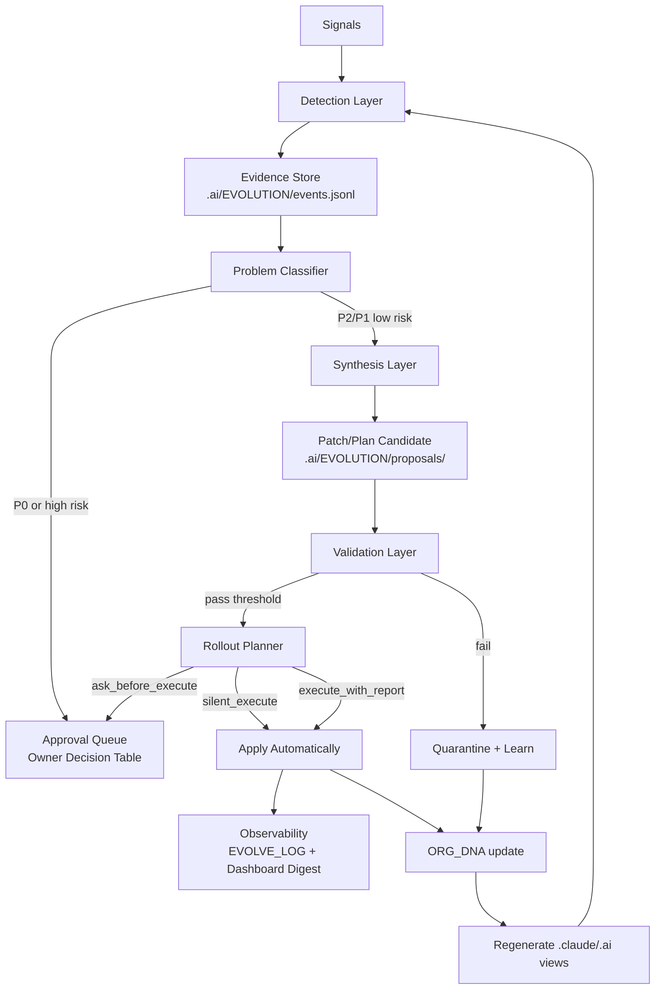

# Codex Analysis v2: T-OS-300-v2

> 作成日: 2026-05-01  
> Role: reviewer + designer  
> Scope: read-only design proposal. Phase 1 の戦術論ではなく、自律進化機構と構造的 UX 転換に限定する。

---

## Executive Summary

OrgOS には既に自律進化の部品がある。`/org-evolve`、Manager Quality Eval、daily health、Capability scan、Memory lint、OIP、Intelligence、Authority Layer、Handoff Packet は存在する。しかし現在の実態は **closed loop ではなく、部品別の点検・提案・ログの集合** である。Owner が「人に依存している」と感じる根本原因は、課題検出から適用までの間に Owner または Manager の手動判断点が残り、かつ進化成果が Owner 体験の変化として表面化しないことにある。

最重要診断は 4 点。

1. **Detection はあるが cadence が弱い**: daily health は 2026-04-19 の 1 回分が確認できる一方、`daily-health` 出力は継続日次ではない。`.ai/INTELLIGENCE/` も config と空ディレクトリ中心で、外部 AI 進化を継続吸収している証拠が薄い。
2. **Synthesis は手順書/提案止まり**: `/org-evolve` は 8 step を定義するが、実運用ログは 2 件だけ。OIP は Draft/Approved が残るが、proposal から実装・検証・適用へ流れる state machine がない。
3. **Validation は pass しやすい**: Manager Quality は 20/20 pass だが、2026-05-01 の JSONL に `No non-legacy handoff packets found.` があり、trace 実体がなくても legacy fallback で pass する。Owner 体感改善の実測ではない。
4. **Application は Authority/Owner 承認で止まりやすい**: Authority Layer は autonomy level を設計しているが、Phase 1 Codex が指摘した通り TASKS に autonomy fields が 0 件で、実タスクの自動適用判定に接続されていない。

Phase 2 で作るべきものは、新しいスローガンではなく **Self-Evolution Engine as runtime** である。最小実装単位は以下。

- `.ai/ORG_DNA.yaml`: rules / commands / agents / skills / schemas / capabilities / evals / owner policy の single source of truth
- `.ai/EVOLUTION/` event store: detection, proposal, validation, rollout, rollback を JSONL で記録
- `scripts/evolution/detect.sh`, `synthesize.sh`, `validate.sh`, `apply.sh`, `rollback.sh`: loop を機械化
- `autonomy_level` と `blast_radius` に基づく自動適用ルール
- Owner Inbox を質問箱から approval ledger に変更し、Owner は「次に決済すべき例外」だけを見る

---

## 1. Diagnosis: なぜ既存自律進化が機能していないか

### 1.1 既存自律進化機構の棚卸し

| 機構 | 実体 | 動作証拠 | 評価 | 診断 |
|---|---|---|---|---|
| Learned skills | `.claude/skills/learned/.gitkeep` | `.gitkeep` のみ、最終更新 2026-01-24 | 不動 | Manager の学習出力先らしき場所だが、学習成果がファイル化されていない |
| `/org-evolve` | `.claude/commands/org-evolve.md` | REVIEW/PICK/MAKE/COMMIT/VERIFY/LOG を定義。外部 scan も定義 | 部分動 | command は厚いが、実行主体・schedule・state store が弱い |
| EVOLVE_LOG | `.ai/EVOLVE_LOG.md` | EVOLVE-001 (2026-03-30), EVOLVE-002 (2026-04-19) の 2 件 | 部分動 | 自律進化は月次/単発に近く、継続 loop の証拠として弱い |
| daily health | `scripts/evolve/daily-health-check.sh` | `.ai/METRICS/daily-health/2026-04-19.md` 1 件。20/20 pass, 68 capabilities | 部分動 | script は書き込み型で実在するが、継続日次 run がない |
| fix task generator | `scripts/evolve/generate-fix-task.sh` | regression から Work Order を生成する実装あり | 部分動 | detection 後の synthesis はあるが、regression 専用で UX/AI 進化には狭い |
| Intelligence | `.ai/INTELLIGENCE/config.yaml` | watch topics と RSS source はある。raw/reports/weekly は `.gitkeep` | 不動 | 外部 AI 進化の watch list はあるが、収集・要約・OIP 化の現行出力がない |
| OIP | `.ai/OIP/OIP-001,006,007,008` | 2026-01 の Draft/提案中/承認済み/APPROVED | 部分動 | proposal archive としては有効。ただし state transition と最新運用がない |
| Manager Quality Eval | `.claude/evals/manager-quality/` | 2026-04-18/19/2026-05-01 JSONL、6 metrics、20 cases | 動 | eval は動く。ただし実会話品質より ledger/mock/fallback に寄る |
| Memory lint | `scripts/memory/*.sh` | daily health で normalize/promote lint ok | 動 | secret/duplicate/promote を検知。ただし学習反映 loop には未接続 |
| Handoff memory updates | `.claude/rules/handoff-protocol.md`, schema | `memory_updates` と trace required を定義 | 部分動 | protocol はあるが ingestion/quarantine/apply 実体が未確認 |
| Authority Layer | `.claude/rules/authority-layer.md`, `scripts/authority/` | approvals/audit/backups が 2026-04-19 に生成 | 部分動 | 承認・監査はあるが autonomy fields が TASKS に実装されていない |
| Capability scan | `scripts/capabilities/scan.sh`, `.ai/CAPABILITIES.yaml` | 2026-04-19 daily health で 68 detected | 動 | 発見は動く。ただし新 capability の取り込み判断・回帰 probe は弱い |
| Runbooks | `.ai/RUNBOOKS/README.md`, `TEMPLATE.md` | 2 ファイルのみ | 部分動 | 手順化ルールはあるが、実 runbook がほぼない |
| CHANGELOG | `.ai/CHANGELOG.md` | v0.23.0 で self-improvement loop 追加を記録 | 動 | 変更履歴は厚いが、進化 loop の実測とは別物 |

### 1.2 Root Cause Analysis

**RC-1: closed loop が分断されている**

Detection、Proposal、Validation、Application、Observability が別ファイル・別コマンドに散っている。daily health は検出できるが、その結果が evolution task、patch candidate、validation、rollout へ必ず進むわけではない。`scripts/evolve/generate-fix-task.sh` は regression から Work Order を生成できるが、生成先は `.ai/CODEX/ORDERS/` であり、Owner 不在時に自動適用される path ではない。

**RC-2: "pass" が Owner 体験を測っていない**

Manager Quality Eval は重要だが、2026-05-01 の `decision_trace_completeness` は `No non-legacy handoff packets found.` でも pass している。これは「trace が機能している」ではなく「fallback が pass 条件を満たした」という意味に近い。Owner が感じる friction、質問回数、決済待ち滞留時間、AI 進化の吸収速度は直接測られていない。

**RC-3: 自律性の policy が task runtime にない**

Authority Layer は `silent_execute`, `execute_with_report`, `ask_before_execute`, `owner_only` を定義しているが、実際の `.ai/TASKS.yaml` に autonomy metadata が入っていない。自律適用できるかどうかの判定材料が Work Graph に存在しなければ、Manager は安全側に倒して Owner へ聞く。

**RC-4: AI 進化 watch が artifact 化されていない**

`.ai/INTELLIGENCE/config.yaml` は AI agents, MCP, Claude Code, OpenAI Blog, releases を watch topic として持つ。しかし raw/reports/weekly が空で、現行モデル/MCP/CLI の差分を OrgOS へどう反映したかが見えない。Owner の「AI 進化に追従」は、この経路が実績を持たない限り満たされない。

**RC-5: Owner 向け UX が "決済" ではなく "状況説明"**

DASHBOARD は多くの情報を含むが、Owner が次に承認すべき例外、放置してよい自動進行、危険な停止を最短で判断する table になっていない。Owner Inbox も approval queue としては未成熟で、質問・通知・判断材料が混ざる。

**RC-6: DNA がないため進化対象が自己記述されていない**

`.orgos-manifest.yaml` は publish/import manifest だが、rules/agents/skills/evals/capabilities の version、owner impact、autonomy policy、validator、regeneration source を持たない。したがって、OrgOS 自身が「何を持っているか」「何が古いか」「何を再生成すべきか」を一貫して判断できない。

### 1.3 「人手が必要」になる場面の typology

| class | 人手の必要性 | 残す/消す | 例 | OrgOS の振る舞い |
|---|---|---|---|---|
| P0 | 避けられない | 残す | Vision 変更、予算、法務/契約、本番破壊操作、公開方針、データ削除 | Owner に 1 つの recommended decision と rollback plan を出す |
| P1 | 避けるべき | 原則消す | フォルダ整理、ルール重複解消、eval regression 修正、stale doc 更新、capability auth drift | 自動 patch + validation + execute_with_report |
| P2 | 避けられる | 消す | API key の所在確認、CLI version 確認、既存 path 探索、タスク状態確認、過去判断検索 | memory/capability/ledger から取得。質問禁止 |

設計原則: Owner に聞いてよいのは P0 だけ。P1 は例外時のみ approval。P2 を聞いたら evolution defect として自動起票する。

### 1.4 Phase 1 課題のうち自律進化があれば人手不要だったもの

| Phase 1 issue | 本来の自動検出 | 本来の自動修正 | 証拠 |
|---|---|---|---|
| `.ai/` root の責務混在 | folder taxonomy lint: owner/internal/runtime/artifact が root で混在 | `.ai/ORG_DNA.yaml` の file ownership から migration PR を生成 | Claude Phase 1 ISS-CLD-001、Codex Phase 1 folder-governance |
| ルール重複/矛盾 | duplicate semantic lint, rule graph consistency | SSOT 参照への置換 patch | `/org-evolve` は重複検出を定義済み、EVOLVE-001 で patterns.md は処理済み |
| Manager Quality の過信 | eval validity audit: fallback pass, mock pass を検出 | fixture-response harness へ置換 task 生成 | Codex Phase 1 ISSUE-CDX-024、2026-05-01 JSONL の fallback note |
| Handoff Packet 未実装 | schema required なのに non-legacy packet 0 を検出 | ingest/quarantine pipeline task 生成 | `.claude/rules/handoff-protocol.md` は protocol を定義済み |
| capability scan の副作用/リスク過小評価 | script capability risk classifier drift | script metadata frontmatter を自動追加 | Codex Phase 1 ISSUE-CDX-017/018 |
| daily health の継続不足 | expected cadence `daily` に対し latest output gap を検出 | launchd/cron/GitHub Actions workflow proposal | `.ai/METRICS/daily-health` は 2026-04-19 のみ |
| OIP の滞留 | OIP status age > threshold | close/supersede/implement task 生成 | OIP-001 Draft, OIP-006 提案中が 2026-01 から残存 |
| Intelligence 空転 | watch config に対し weekly report なし | collector/summarizer/proposal generation task | `.ai/INTELLIGENCE/raw/reports/weekly` は `.gitkeep` のみ |

---

## 2. Self-Evolution Engine 設計

### 2.1 アーキテクチャ全体図



### 2.2 Detection layer

**Detection sources**

| signal | cadence | 判定基準 | output |
|---|---:|---|---|
| eval failure/regression | every commit, daily | latest pass -> fail, metric target miss | `event_type=eval_regression` |
| metrics drift | daily | Owner burden 3d MA >= 7d MA, repeated question > target | `event_type=ux_drift` |
| capability emergence | daily local, weekly external | new CLI/MCP/model release, installed but unregistered tool | `event_type=capability_new` |
| capability degradation | every use, daily | auth expired, version changed, dry-run fails | `event_type=capability_degraded` |
| unused/stale rule | weekly | rule not referenced by DNA/manifest/evals for 30 days | `event_type=rule_stale` |
| Iron Law violation | pre-commit, every Work Order | forbidden path read/write, Owner question P2, direct protected ledger write | `event_type=iron_law_violation` |
| user feedback sentiment | every Owner message | frustration, "why ask me", "slow", "dependent" | `event_type=owner_friction` |
| OIP aging | weekly | Draft/proposed > 14 days without decision | `event_type=oip_stale` |
| intelligence freshness | weekly | no weekly report for watch source | `event_type=intel_stale` |
| DNA drift | every commit | generated file differs from DNA source or unmanaged file appears | `event_type=dna_drift` |

**Implementation**

- Add `scripts/evolution/detect.sh --json` as read-only detector.
- Store normalized events in `.ai/EVOLUTION/events.jsonl`.
- Each event includes `event_id`, `detected_at`, `source`, `evidence_paths`, `severity`, `autonomy_candidate`, `owner_impact`, `blast_radius`, `recommended_next`.
- No Owner notification at detection time unless severity is P0.

### 2.3 Synthesis layer

**Goal**: LLM が修正案を作るが、LLM の裁量を bounded にする。

Inputs:

- event bundle: evidence paths, failing metric, expected invariant
- DNA slice: affected rules/skills/schemas/capabilities
- change budget: max files, max lines, allowed paths, autonomy level
- risk policy: forbidden files, rollback requirement
- prior attempts: last 10 proposals and outcomes

Outputs:

- `proposal.yaml`: problem, hypothesis, patch plan, validation plan, rollback plan
- optional patch: generated branch or patch file
- owner summary: 5-line decision memo only if approval is needed

Agent policy:

- Synthesis agent A generates patch.
- Peer-review agent B reviews the proposal against DNA policy and risk.
- If A and B disagree on risk or rollback, proposal is quarantined.
- Cost budget: daily low-risk synthesis max 3 proposals/day, weekly external capability synthesis max 5 proposals/week.

Quality assurance:

- simulated dry-run: patch applies in temp worktree
- impact check: DNA-owned files only, protected paths blocked
- test plan generated before patch application
- no proposal can ask Owner for P2 facts; missing P2 facts becomes a detector bug

### 2.4 Validation layer

Validation must test both code correctness and Owner-experience improvement.

| validation | required for | threshold |
|---|---|---|
| existing eval suite | all changes | no regression |
| targeted regression fixture | event-specific | failing case becomes pass |
| DNA conformance | DNA changes / generated files | no unmanaged drift |
| authority simulation | autonomy/risk changes | expected allow/deny matrix exact match |
| synthetic Owner simulation | UX/rule changes | fewer P1/P2 questions, same or better task completion |
| A/B rule variant | prompt/rule changes | variant wins by metric and no safety regression |
| canary dry-run | scripts/commands | temp output only, no protected ledger writes |

Synthetic Owner simulation:

- Build fixtures from real Owner friction: repeated question, "任せる", "なぜ聞くの", model/capability changes.
- The simulator is not a replacement for Owner approval; it is a regression filter.
- Success means fewer Owner turns, fewer decision points, same safety outcome.

### 2.5 Application layer

Application uses autonomy, risk, reversibility, and blast radius.

| autonomy_level | eligible changes | action |
|---|---|---|
| `silent_execute` | generated views, cache, stale report cleanup, eval fixture additions with no behavior change | apply + log only |
| `execute_with_report` | low-risk docs/rules clarification, detector additions, runbook generation | apply + weekly digest |
| `ask_before_execute` | `.claude/rules`, `.claude/commands`, DNA policy, workflow changes | Owner approval table |
| `owner_only` | budget, credentials, destructive prod actions, Iron Law weakening, public release | Owner explicit action |

Rollout stages:

1. `shadow`: detector/proposal runs but no patch applies.
2. `canary`: one low-risk proposal/week auto-applies.
3. `progressive`: by category, expand to docs/evals/capabilities.
4. `full`: all eligible `silent_execute` and `execute_with_report` changes apply automatically.

Rollback:

- Every applied proposal stores `rollback_command`, pre-change hash, affected DNA version, validation snapshot.
- Automatic rollback if next eval fails, owner friction metric worsens, or same event reappears twice.
- Rollback itself is logged as first-class evolution event, not erased.

### 2.6 Observability

Owner should see "what changed and why" only at digest level.

Artifacts:

- `.ai/EVOLUTION/events.jsonl`: raw normalized signals
- `.ai/EVOLUTION/proposals/<id>.yaml`: proposal metadata
- `.ai/EVOLUTION/rollouts/<id>.yaml`: apply/rollback state
- `.ai/EVOLVE_LOG.md`: human-readable changelog
- Dashboard card: `Autonomy Health`

Dashboard fields:

- latest successful evolution
- pending Owner decisions count
- auto-applied count this week
- rollbacks count this week
- top friction eliminated
- AI/capability changes absorbed

---

## 3. Owner Bandwidth Conservation Strategy

### 3.1 Owner が消費する 3 リソース

| resource | 現状 | 目標 |
|---|---|---|
| 時間 | 起動・確認・回答・レビューが散発的に発生 | P0 以外の interrupt を週次 digest へ集約 |
| 認知 | DASHBOARD/INBOX/STATUS/DECISIONS を読んで状況理解が必要 | 1 table で "approve / reject / defer" だけ判断 |
| 意思決定回数 | P1/P2 でも Owner 確認が残る | Owner decision <= 3/week, P2 question = 0 |

### 3.2 Owner Touchpoint typology

| touchpoint | owner 必要性 | 方針 |
|---|---|---|
| Vision, budget, compliance, production destructive action | 真に Owner しか決められない | 残す。recommended option + risk + rollback を提示 |
| review cadence, literacy, taste | 推測可能 | learned defaults + override |
| API key, project ref, CLI path | Owner が知っているだけ | memory/capability/secret pointer から取得 |
| progress/result notification | 知らせるだけ | push しない。pull dashboard + digest |
| low-risk OS polish | Owner 不要 | auto-apply |

### 3.3 Owner Inbox を「質問の山」から「決済テーブル」へ

Current anti-pattern:

- "どれにしますか"
- "情報をください"
- "確認してください"
- "次に何をしますか"

Target:

| id | decision | recommendation | risk | default if no response | deadline |
|---|---|---|---|---|---|
| DEC-001 | Apply DNA v0.4 rule regeneration | approve | low, rollback available | auto-approve after 48h | 2026-05-03 |
| DEC-002 | Enable external model probe weekly | approve with cost cap | cost <= budget | defer | 2026-05-07 |
| DEC-003 | Delete old generated artifact alias | reject for now | migration risk | no-op | none |

Rules:

- Inbox contains only decisions, not status.
- Every row has a recommended decision.
- Every row has a no-response default.
- Questions without recommendation are invalid unless Owner-only legal/vision ambiguity.

### 3.4 デフォルト値の sourcing

| source | examples | trust |
|---|---|---|
| learned defaults | Owner prefers CLI over GUI, autonomy over confirmation | high if confirmed and recent |
| community defaults | common model probe matrix, eval threshold, MCP safety patterns | medium |
| similar-project transfer | stack-specific default runbooks, deployment gates | medium with validation |
| local behavior | actual commands used, PR latency, failure history | high |
| model recommendation | LLM suggests new default | low until validated |

Defaults must carry provenance: `source`, `confidence`, `last_verified_at`, `override_path`.

---

## 4. Adaptive Capability Layer 設計

### 4.1 新 LLM 出現時の自動適応

Model-specific names must not be hardcoded into OS behavior. DNA should describe roles and required traits, not vendors.

Model probe flow:

1. detect model source: release feed, installed CLI, API model list, user-installed connector
2. classify capability: planning, implementation, review, synthesis, summarization, tool-use
3. run regression harness: existing 20 Manager Quality cases + coding worker microbench + safety prompts
4. compare against current role baseline: quality, latency, cost, tool reliability, refusal/safety behavior
5. propose role routing update in DNA

Schema sketch:

```yaml
capability_roles:
  implementer:
    requirements:
      - patch_accuracy
      - test_fixing
      - low_hallucination
    candidates:
      - provider: openai
        model_ref: env_or_cli_discovered
        score: 0.91
        verified_at: 2026-05-01
```

### 4.2 新 MCP/CLI 出現時の自動取り込み

Trigger:

- file change in `.mcp.json`, `.claude.json`, package manager bin path, CLI release feed, plugin registry
- command not found in task but installable/discoverable
- recurring Owner/Manager request solved externally

Quality gate:

- local presence check
- version capture
- auth status without leaking secrets
- dry-run support
- destructive operations classified
- least-privilege operation list
- MCP tool schema snapshot

No new capability becomes executable until `risk_level`, `supports_dry_run`, and `owner_approval_required_for` are present.

### 4.3 既存 capability の degradation 検知と mitigation

Signals:

- auth probe fails after previous verified
- command version changes
- CLI output schema changes
- operation starts requiring interactive login
- latency/cost exceeds threshold

Mitigation:

- demote `available -> degraded`
- find alternate capability by role
- create reauth decision only if secret/user action is truly needed
- update runbooks if CLI syntax changed
- add regression fixture from failure

### 4.4 AI 進化に伴う OS の変化形跡

Add `AI Evolution Trace` dashboard:

| date | external change | OrgOS response | validation | rollout |
|---|---|---|---|---|
| 2026-05-xx | new model/tool detected | implementer probe run | +3% pass, cost ok | canary |
| 2026-05-xx | MCP server version changed | schema snapshot updated | no regression | full |

This makes "AI 進化に追従" visible as a product surface, not a hidden maintenance task.

---

## 5. OS DNA: Self-Describing OrgOS

### 5.1 `.ai/ORG_DNA.yaml`

DNA is the single source of truth for OrgOS composition. `.orgos-manifest.yaml` remains an export view generated from DNA.

```yaml
schema_version: 1
orgos_version: 0.24.0
dna_version: 0.1.0

principles:
  iron_laws:
    - id: no_owner_p2_questions
      invariant: "Do not ask Owner for facts obtainable from memory/capability/ledger."
      validator: scripts/evolution/check-owner-questions.sh

components:
  rules:
    - id: request_intake_loop
      path: .claude/rules/request-intake-loop.md
      version: 1.3.0
      owner: orgos
      generated_from: null
      validators: [manager_quality]
  commands:
    - id: org_evolve
      path: .claude/commands/org-evolve.md
      autonomy_default: ask_before_execute
  capabilities:
    source: .ai/CAPABILITIES.yaml
    scan: scripts/capabilities/scan.sh
  evals:
    - id: manager_quality
      path: .claude/evals/manager-quality
      cadence: daily
      pass_required_for: [rule_change, command_change]

owner_policy:
  max_decisions_per_week: 3
  no_response_defaults: enabled
  p2_questions_allowed: false

generation:
  outputs:
    - path: .orgos-manifest.yaml
      template: .ai/TEMPLATES/manifest.yaml.j2
    - path: .claude/rules/INDEX.md
      template: .ai/TEMPLATES/rules-index.md.j2
```

### 5.2 Diff 可能な変更履歴

Use semver-like DNA versioning:

- major: Iron Law or authority boundary changes
- minor: new capability class, new command, new eval suite
- patch: doc/rule wording, generated index, non-behavioral metadata

Every DNA diff must include:

- `why`
- `evidence_event_id`
- `validation_snapshot`
- `rollback_to`
- `owner_touch_required`

### 5.3 他 OrgOS インスタンスとの DNA 同期

Community evolution should be importable without importing project secrets or local Owner preferences.

Flow:

1. export public DNA pack: principles, schemas, commands, evals, capability templates
2. strip local facts, tokens, project refs, private paths
3. compare with local DNA
4. show "benefits / conflicts / required migrations"
5. apply as canary

Conflict policy:

- local Owner preferences win
- Iron Law weakening requires Owner-only approval
- community eval additions can auto-import if non-destructive

### 5.4 DNA に基づく automated regeneration of `.claude/`

Generated targets:

- `.orgos-manifest.yaml`
- `.claude/rules/INDEX.md`
- `.claude/commands/org-help.md`
- `.ai/DASHBOARD.md` generated sections
- `.ai/CAPABILITIES.yaml` normalized view

Protected hand-edited files stay source-owned until migrated. DNA first covers metadata and indexes, then gradually becomes source for rules/commands where safe.

---

## 6. Re-imagined UX

### 6.1 Conversational Sovereignty

Owner should not have to decide what OrgOS should do next. The default interaction becomes:

- Owner gives goal/friction once.
- OrgOS binds it to Work Graph.
- OrgOS decides next action.
- OrgOS only returns when a decision crosses P0/P1 boundary.

Conversation modes:

| mode | trigger | behavior |
|---|---|---|
| `Autopilot` | default | no questions unless P0, progress goes to digest |
| `Decision Brief` | pending approval exists | one recommended decision table |
| `Incident Disclosure` | failure/rollback | explain impact, action taken, remaining decision |
| `Exploration` | Owner explicitly asks brainstorm | options allowed, but ends with recommendation |

### 6.2 Result-First UX

DASHBOARD should begin with decision and outcome, not progress.

Target top:

1. **Decision Table**: Owner decisions needed now
2. **Autonomous Results**: completed since last view
3. **Blocked by System**: failures OrgOS is handling
4. **Evolution Trace**: OS improvements applied/rolled back
5. **Work Graph**: only if Owner drills down

Progress is secondary. The primary question is: "Does Owner need to decide anything?"

### 6.3 Always-On Mode

OrgOS cannot depend on Claude Code being open.

Pathways:

- local launchd/cron for daily detection
- GitHub Actions for repo-safe validation
- optional Slack/email digest for P0 incidents only
- `.ai/EVOLUTION/events.jsonl` as durable event queue
- `orgos daemon status` or `/org-evolve status` for pull-based inspection

Always-On must start in shadow mode to avoid surprise mutations.

### 6.4 Failure Disclosure

Failures should be disclosed as managed incidents, not as requests for help.

Template:

```markdown
## Incident: capability_degraded
- impact: Supabase CLI auth probe failed; deploy-related tasks are paused.
- action taken: demoted capability, selected read-only fallback, created reauth decision.
- Owner decision: approve reauth now / defer 24h.
- default if no response: defer.
```

### 6.5 Marketplace UX

Community OrgOS DNA should feel like applying a tested system update.

Flow:

1. browse DNA pack summary: "adds 12 evals, updates 3 rules, no owner policy changes"
2. compatibility scan
3. preview conflicts
4. canary apply
5. compare metrics before/after
6. keep or rollback

No raw file tree browsing should be required for normal adoption.

---

## 7. Implementation Roadmap

### 7.1 Phase 2 Roadmap (3-6 months)

| task | title | duration | dependency |
|---|---|---:|---|
| T-OS-320 | Evolution Event Store + Detector v1 | 2 weeks | Phase 1 eval/capability/memory scripts |
| T-OS-321 | Owner Decision Table redesign | 1 week | DASHBOARD/INBOX governance |
| T-OS-322 | Autonomy metadata backfill for TASKS | 1 week | Authority Layer |
| T-OS-323 | DNA v0.1 schema + manifest generation | 2 weeks | `.orgos-manifest.yaml`, CAPABILITIES |
| T-OS-324 | Synthesis proposal format + peer review | 2 weeks | event store |
| T-OS-325 | Validation harness: synthetic Owner + fixture-response eval | 3 weeks | Manager Quality Eval |
| T-OS-326 | Application engine: shadow/canary/full rollout | 3 weeks | Authority + validation |
| T-OS-327 | Adaptive Capability Probe | 2 weeks | capability scan |
| T-OS-328 | Intelligence freshness pipeline | 2 weeks | `.ai/INTELLIGENCE/config.yaml` |
| T-OS-329 | Always-On shadow scheduler | 1 week | detector safe mode |
| T-OS-330 | Marketplace DNA import/export | 4 weeks | DNA schema |
| T-OS-331 | Evolution Dashboard / AI Evolution Trace | 2 weeks | event store + rollout logs |

### 7.2 Success Criteria

| metric | baseline | target |
|---|---:|---:|
| P2 Owner questions | unknown | 0/week |
| Owner decisions | unbounded | <= 3/week |
| stale OIP age | > 90 days exists | no stale Draft > 14 days |
| daily health freshness | 1 report observed | latest <= 24h |
| non-legacy handoff packets | 0 observed in eval note | > 95% tasks |
| auto-applied low-risk improvements | 0-rare | >= 3/month |
| rollback time | manual | < 10 min automatic |
| capability freshness | point-in-time | all verified <= 7 days or degraded |
| AI release response | manual | proposal within 7 days |

### 7.3 Phase 1 dependencies

- Folder governance from Phase 1 becomes DNA ownership metadata, not manual tree rearrangement first.
- Startup improvements become Detection target (`first_meaningful_response_ms`), not standalone polish.
- Manager Quality Eval hardening from Phase 1 is prerequisite for trusting auto-application.
- Authority Layer hardening is prerequisite for rollout.
- Handoff ingest is prerequisite for real memory updates and trace-based evolution.

### 7.4 Risks and mitigation

| risk | failure mode | mitigation |
|---|---|---|
| auto-evolution breaks Iron Law | OS weakens its own safety boundaries | Iron Law files owner_only, dual-agent review, fixed validator |
| eval gaming | system optimizes to shallow pass | fixture-response + real trace + Owner friction metrics |
| Owner excluded too much | satisfaction drops despite autonomy | weekly digest, override path, decision defaults visible |
| capability probe leaks secrets | auth check logs sensitive output | redaction validators, no raw secret reads, secret pointer only |
| marketplace import corrupts local policy | community DNA overrides local Owner preference | local policy precedence, canary, conflict preview |
| too many auto changes | trust erosion | rate limit, small batches, rollback, clear trace |

---

## 8. Anti-patterns to Avoid

1. **AI 進化を OS 進化が阻害する**
   - Bad: model names and CLI flags hardcoded in rules.
   - Good: role-based capability requirements with probes and routing.

2. **自律進化が自己正当化する**
   - Bad: eval を自分で緩めて pass にする。
   - Good: validator/eval changes require canary, peer review, and Owner approval if metric semantics change.

3. **Iron Law 自己改修**
   - Bad: auto patch changes forbidden paths or approval boundaries.
   - Good: Iron Law and authority policy are owner_only or ask_before_execute with explicit diff.

4. **Owner 完全排除**
   - Bad: no explanations, silent strategic drift.
   - Good: Owner keeps Vision/Budget/Compliance decisions and sees concise evolution trace.

5. **通知疲れ**
   - Bad: every auto-fix pushed to Owner.
   - Good: pull dashboard and weekly digest; push only incident/P0.

6. **Marketplace cargo cult**
   - Bad: community DNA imported because popular.
   - Good: local compatibility, validation, canary, rollback.

7. **提案だけ増える**
   - Bad: OIP/Work Order pile grows.
   - Good: every proposal has state, owner decision default, expiration, and auto-close condition.

---

## Proposed Immediate Next Step

Phase 2 の最初の実装は T-OS-320/T-OS-321/T-OS-322 の 3 本に絞るべきである。

1. `T-OS-320`: `.ai/EVOLUTION/events.jsonl` と `scripts/evolution/detect.sh --json` を作る。既存の daily health / eval / capability / OIP freshness を read-only で統合する。
2. `T-OS-321`: Owner Inbox/Dashboard を decision table に変える。質問ではなく recommended approval rows だけを出す。
3. `T-OS-322`: active/queued tasks に `autonomy_level`, `owner_input_needed`, `risk_level`, `default_if_no_response` を backfill する。

この 3 本で「Owner がこうしたいと言うまで動かない」から「OrgOS が検出し、低リスクは進め、高リスクだけ決済に上げる」へ最短で移行できる。
