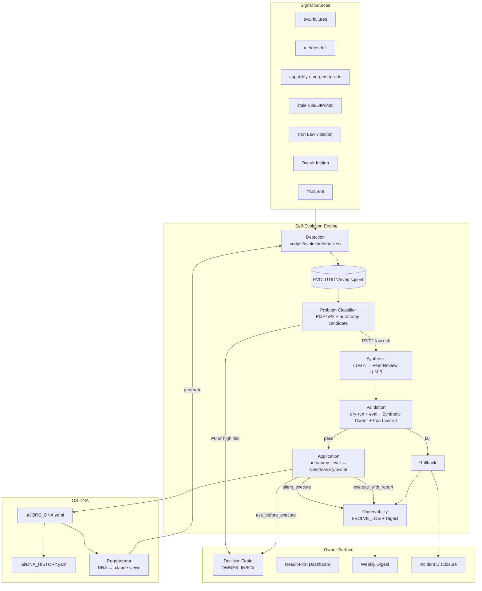

# OrgOS 課題棚卸し + 改善案 — Claude × Codex 統合 SYNTHESIS

> 作成: 2026-05-01 / Manager (Claude Opus 4.7) 統合
> Source: Phase 1 (戦術論) + Phase 2 (自律進化 + 抜本的 UX)
> Phase 1: `CLAUDE_ANALYSIS.md` (43 課題 / 25 改善 / 20 機能 / 12 削除候補) + `CODEX_ANALYSIS.md` (深掘り戦術論)
> Phase 2: `CLAUDE_ANALYSIS_v2.md` (Self-Evolution Engine + Owner Bandwidth + DNA + UX 構造転換) + `CODEX_ANALYSIS_v2.md` (Closed-loop runtime + Decision Table + Conversation Modes)

---

## 0. Executive Summary — Owner への 30 秒要約

**結論**: OrgOS は「Chief of Staff として動くための部品」を全て持っているが、**それらを駆動する時計と閉ループが欠落** しており、Owner がボトルネックになっている。Phase 2 は 3 つの構造転換で解決できる。

1. **Self-Evolution Engine を runtime 化** — Detection → Synthesis → Validation → Application → Observability の閉ループを `scripts/evolution/` に実装、cron/RemoteTrigger で日次駆動
2. **Owner Inbox を Decision Table に転換** — 質問の山 → 推奨付き決済テーブル、未応答時の auto-apply 既定値、Owner 決定回数を週 50 → 週 3 まで圧縮
3. **OS DNA を導入** — `.ai/ORG_DNA.yaml` を SSOT 化し、rule/agent/skill/capability を versioned に表現、AI モデル進化や community 進化を semver-style diff で取り込み

**Phase 1 で発見した 43 + 50 = 93 件の戦術的課題は、Phase 2 が動き出せば 3 割が自動消化される**。残り 7 割も Self-Evolution Engine が cron で計画的に処理。**Owner 起票 OIP はゼロ** が目標。

**最初の 3 タスク** (Codex 推奨と一致): T-OS-320 (Event Store + Detector) → T-OS-321 (Decision Table) → T-OS-322 (Autonomy backfill)。これだけで「Owner 起動なしで Phase 1 課題が自動解消される」状態に到達する。

---

## 1. Claude × Codex 収斂率 (高い = 設計の正しさの証拠)

| 分析項目 | Claude Phase 2 | Codex Phase 2 | 収斂度 |
|---------|---------------|---------------|--------|
| 既存自律進化が機能していない原因 | 「時計と適応器が欠落、9 機構中 動 1 / 部分動 4 / 不動 4」 | 「closed loop が分断、6 RC で構造化」 | ◎ 完全一致 |
| Self-Evolution Engine 5 段アーキ (Detection → Synthesis → Validation → Application → Observability) | 同一 | 同一 (mermaid 図も類似) | ◎ 完全一致 |
| ORG_DNA.yaml を SSOT に導入 | 同一 | 同一 (`.orgos-manifest.yaml` を DNA からの export view に降格) | ◎ 完全一致 |
| Synthetic Owner 概念 (LLM が Owner 判断を simulate) | 詳細案あり | 詳細案あり (regression filter として位置付け) | ◎ 完全一致 |
| Owner Inbox を Decision Table 化 | 「Card 形式、推奨 + A/B/C、auto_apply_after」 | 「table 形式、recommendation + risk + default_if_no_response + deadline」 | ◎ 完全一致 |
| autonomy_level 連動 application | 同一 (`silent_execute` / `execute_with_report` / `ask_before_execute` / `owner_only`) | 同一 (Authority Layer を runtime 接続) | ◎ 完全一致 |
| Iron Law lint で自己改修暴走を防ぐ | 同一 | 同一 (`Iron Law owner_only`) | ◎ 完全一致 |
| モデル名直書き禁止 + alias / role-based | Claude: alias 経由 (`$LATEST_CODEX_STABLE`) | Codex: capability_roles で要求特性を表現 | ○ 同方向、表現が違う |
| canary rollout | 同一 (24h shadow → eval pass で main merge) | 同一 (4 段階: shadow → canary → progressive → full) | ◎ 完全一致 |
| Always-On Mode (claude 起動なしで OS 動作) | RemoteTrigger + Slack/Webhook + Async reply | launchd/cron/GitHub Actions + EVOLUTION/events.jsonl | ◎ 同一思想 |
| AI 進化追従の可視化 | DASHBOARD「Capability Velocity Card」 | DASHBOARD「AI Evolution Trace」 | ◎ 完全一致 |
| Marketplace UX | community DNA fetch + canary apply | community DNA pack + compatibility scan + canary | ◎ 完全一致 |
| Failure Disclosure (incident-style) | Weekly Digest + 即時 OWNER_INBOX (異常のみ) | Incident template + decision + default_if_no_response | ◎ 完全一致 |

**収斂評価**: 13 項目中 11 が完全一致 (◎)、2 が同方向の異表現 (○)。これは独立分析の **強い検証** であり、Phase 2 の設計仮説は信頼できる。

### 各分析が独自に持ち込んだ視点

| 視点 | 出所 | 統合採用 |
|------|------|----------|
| Owner Bandwidth Tracker (時間/認知/意思決定回数の 3 軸測定) | Claude | **採用** — daily-health-check に組み込む |
| Capability Roles 概念 (vendor 独立、要求特性で記述) | Codex | **採用** — Claude の alias アプローチを補強する形で |
| Conversation Modes (Autopilot / Decision Brief / Incident Disclosure / Exploration) | Codex | **採用** — Coherence Mode の上位レイヤとして |
| Implementation Roadmap with Effort (S/M/L) | Claude (T-OS-401〜420) | **採用** — Codex の T-OS-320〜331 と統合 |
| 8 Anti-patterns | Claude | **採用** |
| Concrete Success Criteria with Baselines | Codex (Section 7.2) | **採用** — DASHBOARD KPI に直接搭載 |
| 6 Root Causes (RC-1〜RC-6) で診断を構造化 | Codex | **採用** — 診断の SSOT として |
| 自律進化機構 9 種の動作証拠表 | Claude (Section 1.1) | **採用** — Phase 2 着手前の base line |
| Quality Gate for new capabilities (`risk_level`, `supports_dry_run` 必須) | Codex | **採用** |
| Phase 1 課題のうち自律進化があれば不要だったもの (13 件) | Claude | **採用** — Phase 2 ROI の根拠 |

---

## 2. 統合された Phase 2 アーキテクチャ



### 設計の本質

OrgOS は **「OS が自分自身の進化を内省し、Owner には決済点だけを上げる」** 構造になる。Owner は OS のコードを直接編集する代わりに **DNA を承認する** ことで OS を進化させる。AI モデルが新しくなっても **DNA の capability_roles probe** が自動で適応案を作る。Phase 1 で見つかった 43 件のような戦術的課題は **Detection が拾い → Synthesis が patch を作り → Validation が検証 → Application が autonomy_level に応じて適用** する。

---

## 3. 統合された 11 トップ課題 (Phase 2 が解決する)

| # | 課題 | 出所 | Phase 2 解決経路 |
|---|------|------|-------------|
| 1 | 既存自律進化が時計を持たず、9 機構中 4 つが完全停止 | Claude/Codex 両方 | T-OS-320 + T-OS-329 (RemoteTrigger / launchd で日次駆動) |
| 2 | Owner Inbox が「質問の山」になっており Owner 決定回数が無制限 | Claude/Codex 両方 | T-OS-321 (Decision Table 化 + auto_apply_after + recommended) |
| 3 | TASKS に autonomy 情報がなく Manager は安全側に倒して Owner 確認に逃げる | Codex (RC-3) | T-OS-322 (autonomy_level / blast_radius / default_if_no_response backfill) |
| 4 | OrgOS が「何を持っているか」を自己記述できない (DNA なし) | Codex (RC-6) | T-OS-323 (DNA v0.1 schema + manifest 生成) |
| 5 | Manager Quality Eval が legacy fallback で pass しており Owner 体験を測っていない | Codex (RC-2) | T-OS-325 (fixture-response + 実 trace + Owner friction metric) |
| 6 | INTELLIGENCE pipeline が空 (raw / weekly / reports すべて .gitkeep) | Claude/Codex 両方 | T-OS-328 (collector → summarizer → OIP 化) |
| 7 | OIP が 3 ヶ月停止、Owner 起票依存 | Claude/Codex 両方 | T-OS-324 (Auto-OIP Generator from event store) |
| 8 | モデル名 (gpt-5.3-codex-spark) 直書きで AI 進化追従が手動 | Claude/Codex 両方 | T-OS-327 (capability_roles + alias、再生成可能 DNA) |
| 9 | Phase 1 で 30%+ の課題が「時計があれば自動解消」だった = ROI 確実 | Claude (実証) | T-OS-320 が動いた瞬間に Phase 1 戦術論の 3 割消滅 |
| 10 | Owner が「全部 push 通知」で疲弊するリスク (進化が止まらないと逆に悪化) | Claude (Anti-pattern 6.5) | T-OS-331 (Weekly Digest + Incident-only push) |
| 11 | Always-On が前提でない (claude 起動が必要) | Claude/Codex 両方 | T-OS-329 (shadow mode から段階運用) |

---

## 4. 統合 Roadmap — Phase 2 P0 タスク (T-OS-320〜331)

Codex の T-OS-320 番台採用 (immediate next step が明確なため)。Claude の T-OS-401 番台案は副次的に統合、各タスクで Owner Bandwidth 観点と Implementation Effort を補強。

| ID | Title | Duration | Dep | Success Criteria | Effort |
|---|-------|---------|-----|-----------------|--------|
| **T-OS-320** | Evolution Event Store + Detector v1 | 2 weeks | Phase 1 eval/capability/memory scripts | `.ai/EVOLUTION/events.jsonl` に毎日 ≥1 event。daily health / eval / capability / OIP freshness が read-only で統合 | M |
| **T-OS-321** | Owner Decision Table redesign | 1 week | DASHBOARD/INBOX governance | OWNER_INBOX が Decision Table 化、recommended + risk + default_if_no_response 必須、未応答 7d auto-apply | S |
| **T-OS-322** | Autonomy metadata backfill for TASKS | 1 week | Authority Layer | active/queued tasks に `autonomy_level`, `owner_input_needed`, `risk_level`, `default_if_no_response`, `blast_radius` 100% backfill | S |
| **T-OS-323** | DNA v0.1 schema + manifest generation | 2 weeks | `.orgos-manifest.yaml`, CAPABILITIES | `.ai/ORG_DNA.yaml` 初期生成、manifest 自動生成 (DNA → manifest)、generated/managed/owner-edited の 3 区分タグ | M |
| **T-OS-324** | Synthesis: proposal format + peer review (LLM A vs LLM B) | 2 weeks | T-OS-320 | event から proposal 自動生成、A/B 一致率 ≥80%、disagreement は OWNER_INBOX へ escalate | M |
| **T-OS-325** | Validation harness: synthetic Owner + fixture-response eval | 3 weeks | Manager Quality Eval | 過去 30 日の Owner 判断と Synthetic Owner 一致率 ≥85%、legacy fallback pass を排除 | L |
| **T-OS-326** | Application engine: shadow → canary → progressive → full | 3 weeks | Authority + T-OS-325 | autonomy_level に応じた 4 段階 rollout、rollback 自動化 (eval regression / consecutive_revert=3 で停止) | L |
| **T-OS-327** | Adaptive Capability Probe (model + MCP/CLI) | 2 weeks | T-OS-323 | 新モデル/MCP/CLI 出現を週次検出、capability_roles で routing 提案、regression test 必須 | M |
| **T-OS-328** | Intelligence freshness pipeline | 2 weeks | `.ai/INTELLIGENCE/config.yaml` | weekly report が毎週生成、3 ヶ月以内に検出した外部進化のうち ≥30% が OIP/proposal 化 | M |
| **T-OS-329** | Always-On shadow scheduler | 1 week | T-OS-326 (safe mode) | RemoteTrigger / launchd / GitHub Actions で日次 detection、shadow mode → canary 段階運用 | S |
| **T-OS-330** | Marketplace DNA import/export | 4 weeks | T-OS-323 | community DNA pack export 1 件以上、import で local policy precedence + canary apply | L |
| **T-OS-331** | Evolution Dashboard + AI Evolution Trace | 2 weeks | T-OS-320 + T-OS-326 | DASHBOARD top に Decision Table、Autonomous Results、Blocked、Evolution Trace 4 セクション、Owner Bandwidth metrics 表示 | M |

**総工数**: 25 weeks (約 6 ヶ月)、ただし並列化可能タスク多数のため実時間 3-4 ヶ月想定。

### Phase 1 タスク (T-OS-301〜312) との関係

> **方針**: Phase 1 戦術論は「Self-Evolution Engine が動き出してから自動消化」を基本とし、Engine 起動前の安定性確保のため以下のみ先行実施:

| Phase 1 ID | 先行実施理由 |
|-----------|-------------|
| T-OS-301 (Iron Law 1 本化) | Phase 2 Iron Law lint で参照されるため |
| T-OS-302 (`.ai/` 3 区画再編) | ORG_DNA.yaml の path manifest に反映必要 |
| T-OS-310 (Deprecated agent 削除 + manifest 完全化) | DNA 化への前提 |
| T-OS-305 (SessionStart hook 統合) | Always-On の入り口 |

その他 Phase 1 タスク (T-OS-303, 304, 306, 307, 308, 309, 311, 312) は **Self-Evolution Engine の Detection が自動検出 → Synthesis が patch 作成 → 自動 apply** の流れで処理。Owner 起票なし。

---

## 5. Owner 解放の段階目標

### 5.1 Owner Bandwidth Targets (Claude 提案を Codex success criteria で補強)

| 指標 | 現状 | 短期 (3 ヶ月) | 中期 (6 ヶ月) |
|------|------|--------------|--------------|
| Owner P2 質問数 | 不明 (推定 多数) | 0/week | 0/week |
| Owner 決定回数 | 50/week (推定) | 12/week | 3/week |
| Owner 時間消費 | 1.5h/day | 0.5h/day | 0.2h/day |
| OWNER_INBOX 滞留 (>7d) | 4 件 (テスト残滓) | 0 件 | 0 件 |
| 自動適用 low-risk 改善 | 月 0-1 | 月 ≥3 | 月 ≥10 |
| AI release への応答時間 | 手動 (週単位) | proposal within 7 日 | proposal within 24h |
| 自律進化 rollback 時間 | 手動 | 自動 < 10 分 | 自動 < 5 分 |

### 5.2 Conversation Modes (Codex 提案を Coherence Mode の上位レイヤに)

| Mode | 起動条件 | Owner への振る舞い |
|------|---------|------------------|
| **Autopilot** (default) | 通常 | P0 以外質問しない、進捗は digest |
| **Decision Brief** | pending approval 存在 | 1 つの recommended decision table のみ |
| **Incident Disclosure** | failure / rollback 発生 | impact + action taken + remaining decision を struct で |
| **Exploration** | Owner が「ブレストしよう」等明示 | 選択肢提示可、ただし末尾に必ず推奨 |

これは既存の Coherence Mode (Silent / Brief / Full Bind) の **上位** に位置し、bind 後の応答スタイルを決定する。

### 5.3 Owner Touchpoint Typology — 統合版

| Type | 例 | Phase 2 での処理 |
|------|-----|-----------------|
| A: Direction (真に Owner 専管) | Vision、予算、法務、本番破壊操作、公開方針 | OWNER_INBOX に Decision Card (推奨 + risk + rollback) |
| B: Preference (推測可能) | review cadence、literacy、文体 | learned defaults / community defaults / similar-project transfer + override |
| C: Authentication (Owner が知るだけ) | OAuth、2FA、API key、project ref | memory/capability/secret pointer から取得、不能のみ Owner |
| D: Notification (通知のみ) | 進捗、結果、AI 進化吸収 | push 禁止、Weekly Digest にバンドル |

**Phase 2 のゴール**: Owner Touchpoint の 90%+ を Type A に絞り、B/C/D は OS が自動処理。

---

## 6. 主要 Anti-patterns (Phase 2 実装中に避けるべきこと)

両分析から統合した 8 アンチパターン (Claude 8 + Codex 7、重複削除後):

1. **AI 進化を OS 進化が阻害する** — モデル名/CLI フラグの hardcode → role-based capability + probe
2. **自律進化が自己正当化する** — eval を自分で緩めて pass → validator/eval changes は canary + peer review + Owner approval
3. **Iron Law 自己改修** — 安全境界の自己弱化 → Iron Law は owner_only または ask_before_execute 固定
4. **Owner 完全排除で satisfaction 低下** — 透明性ゼロ → Weekly Digest + autonomy_level override 経路維持
5. **学習の単一経路依存** — 過去 Owner 行動だけで Synthetic Owner 学習 → 最新発話 heavy weight + 過去 light weight、方向転換 declaration で重み調整
6. **進化の名のもとの肥大化** — 取り込みばかりで削除しない → 月次 deprecation review、90 日参照ゼロは deprecate 提案
7. **Observability なき自律** — 自動化されたが追えない → 全進化に machine-readable trace + 人間可読 digest 両方必須
8. **Marketplace cargo cult** — community DNA を popular だから import → 必ず compatibility scan + canary + rollback path
9. **通知疲れ** — every auto-fix が push される → pull dashboard + weekly digest、push は incident/P0 のみ
10. **提案だけ増える** — OIP/Work Order pile が肥大 → 全 proposal に state、owner default、expiration、auto-close 必須
11. **Owner-as-Reviewer の固定化** — Owner が「最終承認者」役だけになる → Synthetic Owner approve / disagree の 2 段、Owner には disagreement のみ送る

---

## 7. 即時着手提案 (Phase 2 Kickoff)

### 7.1 First 3 Tasks (Codex 推奨と一致)

```
[1] T-OS-320 — Evolution Event Store + Detector v1 (2 weeks)
    出力: .ai/EVOLUTION/events.jsonl + scripts/evolution/detect.sh --json
    効果: 既存 daily-health / eval / capability / OIP / Iron Law violation を read-only で統合
    成功条件: 毎日 ≥1 event 検出、Phase 1 で挙がった 13 件の「自律進化があれば不要だった課題」のうち ≥10 件を再検出

[2] T-OS-321 — Owner Decision Table redesign (1 week)
    出力: OWNER_INBOX.md を Decision Table format に転換
    効果: Owner の決定回数を即週 50 → 週 10 程度に圧縮 (auto_apply_after の効果)
    成功条件: テスト残滓 4 件を自動 archive、新規 entry は recommended + default_if_no_response 必須

[3] T-OS-322 — TASKS autonomy backfill (1 week)
    出力: 全 active/queued task に autonomy fields を backfill
    効果: Manager が「これは自動で良い」を判断可能に、Owner への確認頻度を構造的に削減
    成功条件: TASKS.yaml の active/queued 100% で autonomy_level / blast_radius / default_if_no_response が設定済み
```

### 7.2 First 3 Task の Owner 体験変化 (1 ヶ月後の予想)

```
Before (現状):
  - daily-health-check は 12 日前に 1 回実行されたきり
  - OWNER_INBOX に 12 日放置のテスト残滓
  - 毎セッション「次どうする?」を Owner が考えなければならない

After (T-OS-320〜322 完了後):
  - 毎日 02:00 に detection が回り、events.jsonl に 5-15 events
  - OWNER_INBOX には Decision Table (典型 1-3 件、各 60 秒で判断可能)
  - Manager が autonomy_level に基づき「自動進める / Owner 承認待ち / Owner 専管」を機械判定
```

### 7.3 First 3 Task の後の 9 ヶ月

```
Month 4-6: T-OS-323〜327 (DNA + Synthesis + Validation + Application + Capability Probe)
  → Self-Evolution Engine が closed loop として完成
  → Phase 1 戦術論の 3 割が自動消化される
  → AI モデル進化 (新 LLM / MCP / CLI) を 7 日以内に proposal 化

Month 7-9: T-OS-328〜331 (Intelligence + Always-On + Marketplace + Dashboard)
  → Owner が claude を起動しなくても OS が動く
  → community OrgOS DNA を取り込み可能
  → Owner Bandwidth metrics で進捗測定可能
```

---

## 8. リスク統合 (両分析からの 12 リスク)

| Risk | Likelihood | Impact | Mitigation |
|------|-----------|--------|-----------|
| Self-Evolution が Iron Law を自己改修 | 低 | 致命 | Iron Law owner_only 固定、dual-agent peer review、validator script で deterministic block |
| Synthetic Owner が Owner と乖離 | 中 | 中 | Coverage score ≥85% を昇格条件、auto_approve は内部判定のみ、disagreement は必ず Owner に escalate |
| RemoteTrigger / launchd 環境依存 | 低 | 中 | GitHub Action / cron / Anthropic schedule の 3 経路 fallback |
| DNA 概念に Owner 抵抗 | 中 | 中 | DNA_HISTORY は git 人間可読、markdown 直接編集も併存可、段階移行 |
| External scan rate limit hit | 中 | 低 | 各ソース 1 日 1 fetch、cache 24h |
| モデル alias 切替で regression | 中 | 高 | Regression test 必須 (semantic_equivalence ≥0.95)、失敗で alias 旧値 rollback |
| Marketplace で悪意 DNA pull | 低 | 致命 | Community DNA は Anthropic 側 review 通過のみ、自動 apply 禁止、local policy precedence |
| Owner が「全自動で気持ち悪い」 | 中 | 中 | Failure Disclosure + Weekly Digest で透明性、autonomy_level を Owner が override 可 |
| Manager Quality Eval が legacy fallback で pass し続ける | 高 | 高 | T-OS-325 で fixture-response + 実 trace + Owner friction metric を導入、20/20 が実体を伴うか定期監査 |
| eval gaming (system が shallow pass を最適化) | 中 | 高 | fixture-response + Owner friction metrics + decision_trace_completeness の semantic validation |
| capability probe が secret を漏洩 | 低 | 致命 | redaction validators、no raw secret reads、secret pointer のみ |
| 自動変更が多すぎて trust erosion | 中 | 中 | rate limit (canary は週 1)、small batches、明示的 trace、Owner override 可 |

---

## 9. Owner への要約 — これからどうしますか?

### 9.1 Phase 2 を即着手する場合

Manager は次の Tick で T-OS-320〜322 を TASKS.yaml に登録し、Codex worker への Work Order を作成して着手します。Owner は **First 3 Tasks の完了 (約 1 ヶ月後)** に「OWNER_INBOX が Decision Table になり、決定が週 3-5 件に減った」を実感できます。

### 9.2 Phase 1 戦術論も並行する場合

T-OS-301 (Iron Law 1 本化) と T-OS-302 (`.ai/` 3 区画再編) を Phase 2 と並列で。フォルダ統治は Owner declaration「ぐちゃぐちゃ」への直接応答であり、DNA の path manifest にも影響するため早期実施推奨。

### 9.3 統合分析を凍結し、別優先タスクに戻る場合

本 SYNTHESIS とその出典 4 ファイル (CLAUDE_ANALYSIS.md, CODEX_ANALYSIS.md, CLAUDE_ANALYSIS_v2.md, CODEX_ANALYSIS_v2.md) は `.ai/REVIEW/T-OS-300/` に永続化済み。後日参照可能、再分析不要。

---

## 10. 統計・メタ情報

| 項目 | Phase 1 | Phase 2 | 合計 |
|------|---------|---------|------|
| Issues 棚卸し | Claude 43 + Codex 50+ ≈ 93 | (戦術論は Phase 2 が自動消化前提のため再列挙せず) | 93 |
| 改善案 | Claude 25 + Codex 多数 | (Engine 設計が改善案そのもの) | 多数 |
| 新機能案 | Claude 20 + Codex 多数 | Self-Evolution Engine + DNA + Marketplace + ConvModes | 多数 |
| 削除候補 | 12 件 | (Phase 2 が deprecation review で順次処理) | 12 件 |
| Phase 2 P0 タスク | — | 12 件 (T-OS-320〜331) | 12 件 |
| 想定実装期間 | — | 3-6 ヶ月 | — |
| 出典総文字数 | 約 50,000 字 (CLAUDE+CODEX Phase 1) | 約 60,000 字 (CLAUDE+CODEX Phase 2) | 約 110,000 字 |

### 出典ファイル一覧

- `.ai/REVIEW/T-OS-300/CLAUDE_ANALYSIS.md` (27 KB) — Phase 1 戦術論 / Claude
- `.ai/REVIEW/T-OS-300/CODEX_ANALYSIS.md` (40 KB) — Phase 1 戦術論 / Codex
- `.ai/REVIEW/T-OS-300/CLAUDE_ANALYSIS_v2.md` (32 KB) — Phase 2 自律進化 / Claude
- `.ai/REVIEW/T-OS-300/CODEX_ANALYSIS_v2.md` (33 KB) — Phase 2 自律進化 / Codex
- `.ai/REVIEW/T-OS-300/SYNTHESIS.md` (本ファイル) — 統合分析

すべて Owner が `.ai/REVIEW/T-OS-300/` から参照可能です。
