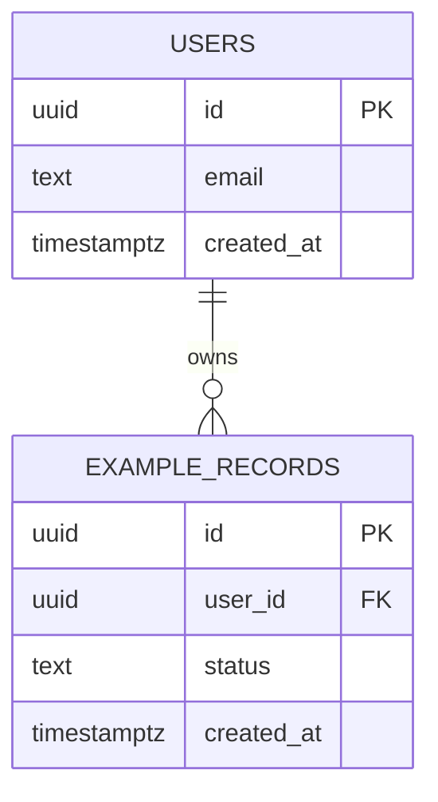
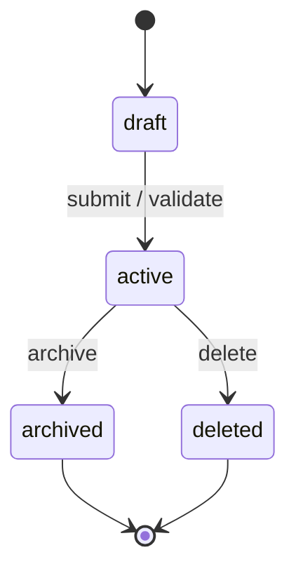

# Data Model Full

## Metadata

| Field | Value |
|---|---|
| Project / Milestone | `TODO` |
| Related Journey | `TODO: JOURNEY-ID / flow name` |
| Related Quality Contract | `TODO: QC-ID` |
| Author | `TODO` |
| Reviewers | `TODO` |
| Status | `draft / confirmed / superseded` |
| Last Updated | `YYYY-MM-DD` |

## Scope

- Product area:
  - `TODO`
- Data stores covered:
  - `TODO: Postgres / storage / cache / queue / external system`
- Out of scope:
  - `TODO`

## All Tables

| Table | Purpose | Owner | Lifecycle | Key Columns | PII / Secret? | Delete Strategy |
|---|---|---|---|---|---|---|
| `TODO: table_name` | `TODO: why it exists` | `TODO: role/service` | `TODO: created -> active -> archived/deleted` | `TODO: id, user_id, status` | `yes/no` | `hard / soft / archive` |

## ER Diagram

## Entity State Machines

### `TODO: Entity Name`

| State | Meaning | Allowed Transitions | Guard / Invariant |
|---|---|---|---|
| `draft` | `TODO` | `active` | `TODO` |
| `active` | `TODO` | `archived`, `deleted` | `TODO` |

## Invariants

| ID | Invariant | Enforced By | Violation Handling | Test |
|---|---|---|---|---|
| `INV-001` | `TODO: e.g. one active subscription per user` | `TODO: unique index / transaction / application guard` | `TODO: reject / rollback / repair job` | `TODO` |

## Transaction Boundaries

List every operation that must be atomic. If an operation writes more than one row, calls external services, or changes state, it belongs here.

| Operation | Trigger | Tables / External Systems | Atomic Boundary | Isolation / Lock Strategy | Rollback Strategy | Test |
|---|---|---|---|---|---|---|
| `TODO: create_order` | `TODO: endpoint/job` | `TODO: orders, order_items` | `TODO: single DB transaction` | `TODO: row lock / unique constraint / optimistic lock` | `TODO: rollback all writes` | `TODO: forced failure test` |

## Idempotency Strategy

List every operation that can be retried, double-submitted, or delivered more than once.

| Operation | Idempotent? | Idempotency Key | Key Scope | Storage / Constraint | Replay Response | Expiry | Test |
|---|---|---|---|---|---|---|---|
| `TODO: create_order` | `yes/no` | `TODO: user_id + client_request_id` | `TODO: per user / per tenant / global` | `TODO: unique index / idempotency table` | `TODO: return original result` | `TODO: none / 24h / 30d` | `TODO: same key replay` |

## Delete Strategy

| Resource / Table | Strategy | Who Can Delete | Retention | Cascade / Restrict | Recovery | Audit Required |
|---|---|---|---|---|---|---|
| `TODO` | `hard / soft / archive` | `TODO: role` | `TODO: duration` | `TODO: cascade/restrict/manual` | `TODO: restore path or none` | `yes/no` |

## Data Access Patterns

| Query / Use Case | Tables | Expected Cardinality | Index Required | Pagination / Limit | Security Scope |
|---|---|---|---|---|---|
| `TODO` | `TODO` | `TODO` | `TODO` | `TODO` | `TODO: user_id / tenant_id / admin` |

## Migration Plan

| Step | Change | Backfill | Compatibility | Rollback |
|---|---|---|---|---|
| `1` | `TODO` | `TODO` | `TODO` | `TODO` |

## Open Questions

| Question | Owner | Blocker? | Decision Needed By |
|---|---|---|---|
| `TODO` | `TODO` | `yes/no` | `YYYY-MM-DD` |

## Sign-off

- All persistent resources listed: `yes/no`
- ER diagram complete: `yes/no`
- State machines complete for major entities: `yes/no`
- Invariants mapped to enforcement: `yes/no`
- Transaction boundaries complete: `yes/no`
- Idempotency keys complete: `yes/no`
- Delete strategy complete: `yes/no`
- Confirmed at: `YYYY-MM-DD`
